# **カルダノステークプール構築手順**

<!--!!! summary "概要"
    このマニュアルは、[X Stake Pool](https://xstakepool.com)オペレータの[BTBF](https://twitter.com/btbfpark)が[CoinCashew](https://www.coincashew.com/coins/overview-ada/guide-how-to-build-a-haskell-stakepool-node#9-register-your-stakepool)より許可を得て、日本語翻訳しております。
-->

!!! info "情報"
    このマニュアルは、カルダノノードv1.34.1に対応しています。  
    最終更新日：2022年5月21日の時点guide version 12.1

!!! tip "サポート"
    サポートが必要な場合は、[SPO JAPAN GUILDコミュニティ](https://discord.gg/U3gU54c)で現役のSPOに質問できます


## **0-1.SPOの必須スキル**

カルダノステークプールを運営するには、以下のスキルを必要とします。

* カルダノノードを継続的にセットアップ、実行、維持する運用スキル
* ノードを24時間年中無休で維持するというコミット
* システム運用スキル
* サーバ管理スキル \(運用および保守\)
* 開発と運用経験 \(DevOps\)
* サーバ強化とセキュリティに関する知識


## **0-2.サーバースペック要件**

=== "最小構成"
    | 項目      | 要件                          |
    | :---------- | :----------------------------------- |
    | **サーバー**      | BP用1台  リレー用1台  エアギャップマシン1台  |
    | **OS**       | 64-bit Linux \(Ubuntu 20.04 LTS\) |
    | **CPU**   | 2Ghz以上 2コアのIntelまたはAMD x86プロセッサー|
    | **メモリ**    | 12GB |
    | **ストレージ**    | 150GB |
    | **ネットワーク**    | 10Mbps |
    | **帯域**    | 1時間あたり1GBの帯域 |
    | **電力**    | 24時間365日安定供給 |
    | **ADA**    | 600ADA |


=== "推奨構成"
    | 項目      | 要件                          |
    | :---------- | :----------------------------------- |
    | **サーバー**      | BP用1台  リレー用2台  エアギャップマシン1台  |
    | **OS**       | 64-bit Linux \(Ubuntu 20.04 LTS\) |
    | **CPU**   | 2Ghz以上 4コアのIntelまたはAMD x86プロセッサー|
    | **メモリ**    | 16GB |
    | **ストレージ**    | 256GB以上 |
    | **ネットワーク**    | 100Mbps |
    | **帯域**    | 無制限 |
    | **電力**    | 24時間365日安定供給 |
    | **ADA**    | 無制限 |

### **プール構成のイメージ**

**最小構成**
``` mermaid
    flowchart BT
        a2[リレー1] <-- 開放FW --> a4[カルダノネットワーク]
        subgraph ide1[プール]
            subgraph リレーIP指定FW
                a1[BP]
            end
        a1[BP] <--> a2[リレー1]
        end
        c1[PC] --> ide1
        c1[PC] --> エアギャップ
```

**推奨構成**
``` mermaid
    flowchart BT
        a2[リレー1] & a3[リレー2] <-- 開放FW --> a4[カルダノネットワーク]
        subgraph ide1[プール]
            subgraph リレーIP指定FW
                a1[BP]
            end
                a1[BP] <--> a2[リレー1] & a3[リレー2]
        end
        c1[PC] --> ide1
        c1[PC] --> エアギャップ
```


## **0-3.お試しノード起動**

!!! hint ""
    * Linuxサーバのコマンドや、ノード起動などお試しテストでやってみたい方は、手元のパソコンでエアギャップ環境を構築し左メニューの1，2をやってみましょう！
    * この項目はブロックチェーンには直接的に影響がないので、たとえ間違ったコマンドを送信してもネットワークには問題ございません。

## **0-4.エアギャップマシンの作成**

!!! summary "エアギャップマシンとは？"
    プール運営で使用するウォレットの秘密鍵やプール運営の秘密鍵をオフライン上で管理し、エアギャップオフラインマシンでCLIを起動しトランザクションファイルに署名する作業に使用します。
    
    * ウォレットの秘密鍵やプール運営の秘密鍵をプール運営のオンラインマシン上に保管すると、ハッキングなどの際に資金盗難のリスクがあります。

### Windowsの場合

!!! hint "貢献者"
    [[SA8] SMAN8](https://adapools.org/pool/ec736597797c68044b8fccd4e895929c0a842f2e9e0a9e221b0a3026) さんに導入手順を作成頂きました。ありがとうございます！


**環境**
・Windows10/11  
・64ビット  
・メモリ8GB以上

**ダウンロード/インストール**
- Ubuntu Desktop 20.04.4 LTS  
- VirtualBox 6.1.14


#### **1- VirtualBoxのダウンロード**
[公式ORACLE社のダウンロードサイト](https://www.oracle.com/jp/virtualization/technologies/vm/downloads/virtualbox-downloads.html)
にアクセスし、「3.環境の確認」の②のシステム情報は64ビットなので、下の赤い四角の線で囲まれた
”windowsインストーラ”をクリックする。  


#### **2- VirtualBoxのインストール**

2-1.ダウンロードしたvirtualbox6.1.14のインストーラをダブルクリックで起動する。  
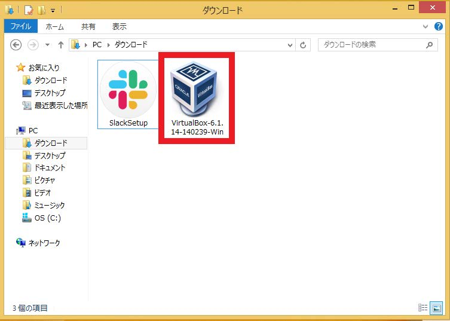

2-2.Nextをクリック  


2-3.Nextをクリック  


2-4.Nextをクリック  
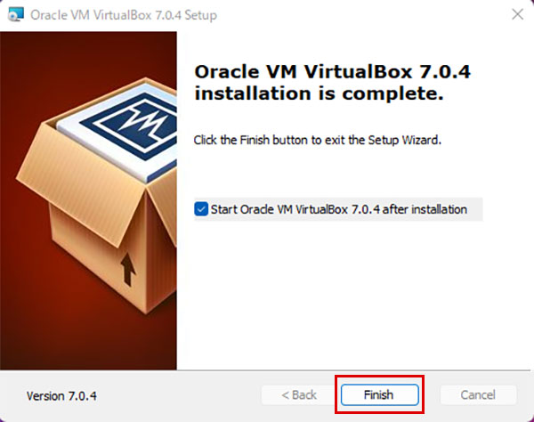

2-5.Yesをクリック  
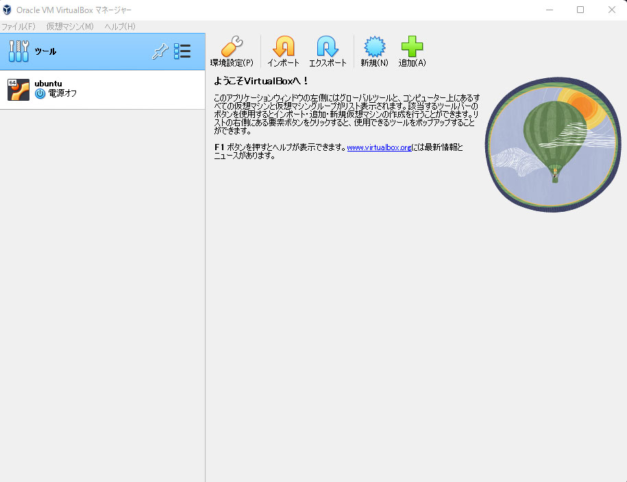

2-6.Installをクリック  
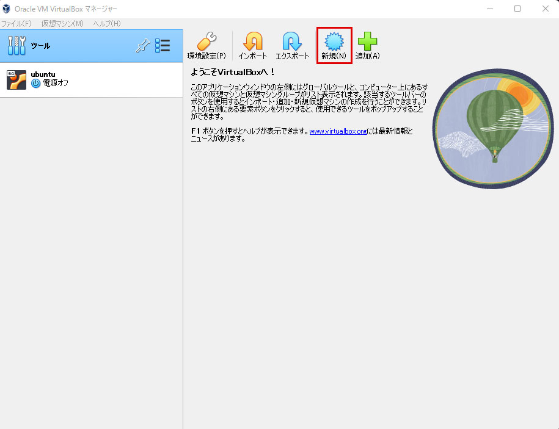

2-7.インストールをクリック  


2-8.VirtualBoxの管理画面が立ち上がり、インストールが完了しました。


#### **3- OS Ubuntuの入手**
3-1.UbuntuのIOSイメージをダウンロードします。
[https://www.ubuntulinux.jp/download ](https://www.ubuntulinux.jp/download) 
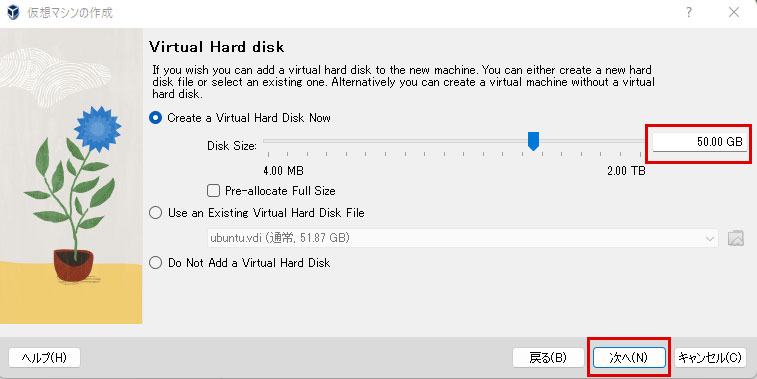

3-2.Ubuntu 20.04.1 LTS のubuntu-ja-20.04.1-desktop-amd64.iso(ISO)をクリック。
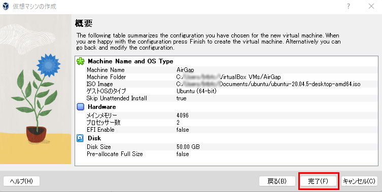

3-3.ubuntu-ja-20.04.1-desktop-amd64.isoをダウンロードしたら、その IOSディスクの置き場所(フォルダ)を
決めてそこに移動しておく。今回はテスト用として作成したTest_CNodeというフォルダを作成し移動した。
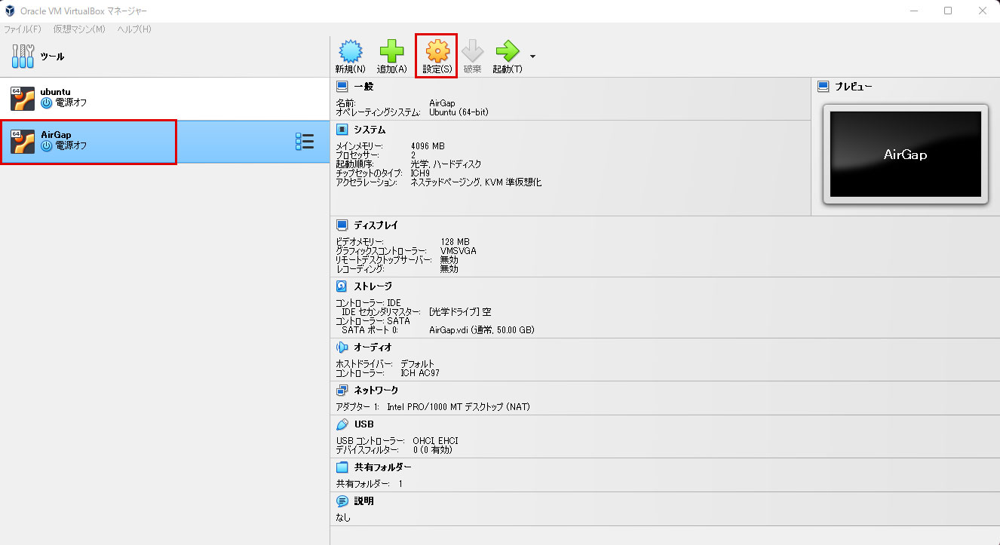

#### **4- VirtualBoxのインストール後の環境設定**
4-1.VirtualBoxの起動画面を開く。(下の画像のこと)


4-2.環境設定を選択。
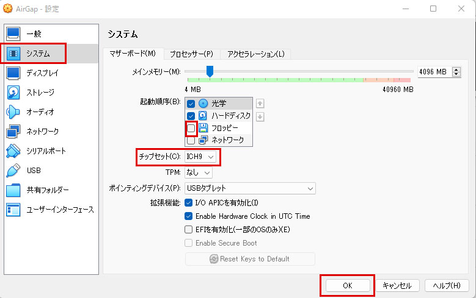


4-3.一般>ディフォルトの仮想マシンフォルダ(M)のプルダウンリストから”その他”を選択し、VirtualBox上で動作
させるOS(ゲストOS)ファイルの置き場所を選択する。
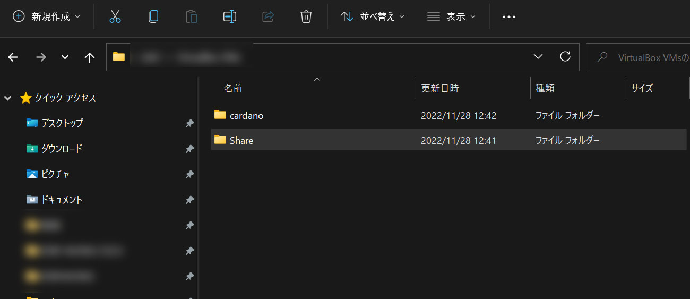


4-4.先程の3-3で移動したIOSディスクの置き場所(フォルダ)を選択しOKボタンを押す。
設定は完了。


#### **5- VirtualBoxの仮想マシンの作成**

5-1.VirtualBoxの環境設定内容を確認  
・OSはUbuntu20.04  
・ハードディスクは50GB  
・メモリは4GB  
・スワップ設定は8GB  
※スワップとは、メモリが足りない時にメモリの中身をハードディスクに移す機能の事  

5-2.新規(N)をクリック。  


5-3.仮想マシンの名前、マシンのデータ関係の保存先を指定する。①は仮想マシンの名前を入力。②のマシンフォルダは
仮想マシン用として作成したTest_CNodeというフォルダを指定。③はLinux、④は3の「環境の確認」で、
システム情報に記載されていた64bitを選択する。  
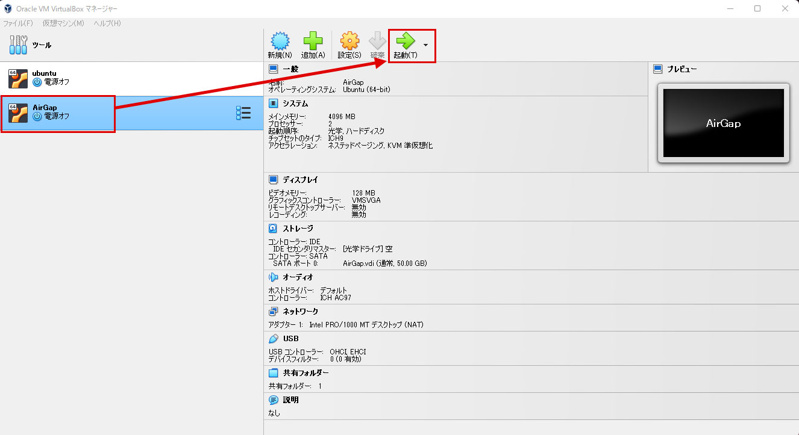


5-4.メモリーサイズは4GB(4000MB)に変更する。  
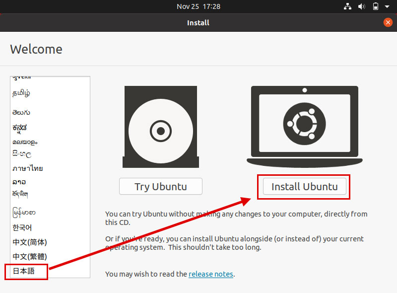


5-5.下の画像のように「仮想ハードディスクを作成する( C )」のまま”作成”をクリック。  


5-6.「VDI(VirtualBox Disc Image)」のまま、”次へ(N)”をクリック。  
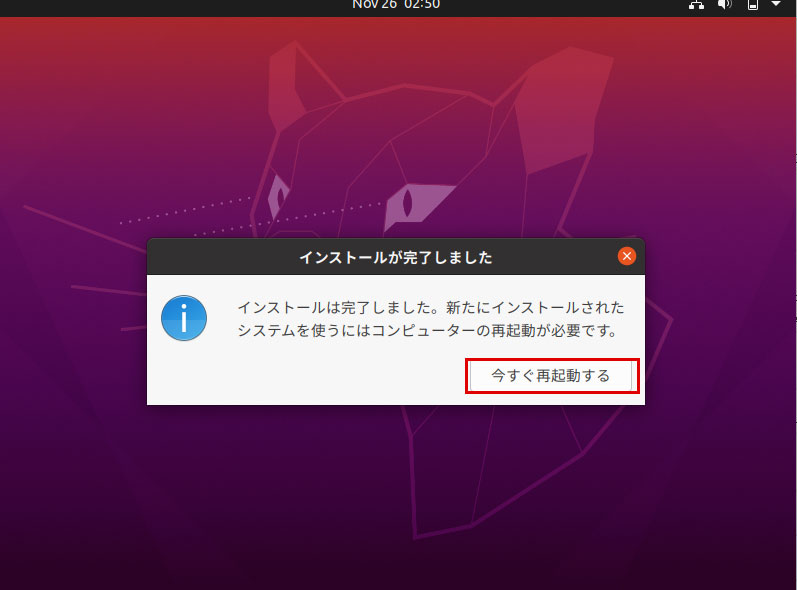


5-7.「可変サイズ(D)」のまま”次へ(N)”をクリック。  
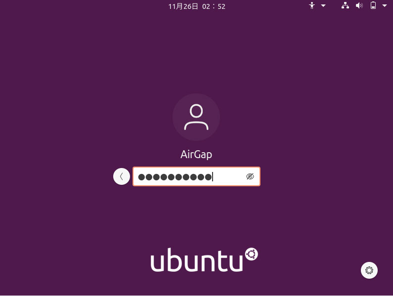

5-8.ハードディスクのサイズを50GBに変更し”作成”をクリック。  


5-9.仮想マシンが作成された。   


#### **6- VirtualBoxの仮想マシンの環境設定**

6-1.対象の仮想マシンを選択したまま赤い四角の線に囲まれた”設定”をクリック。  


6-2.一般>高度(A)へと移動し、クリップボードの共有とドラッグ&ドロップを”無効”から”双方向”へ変更する。  
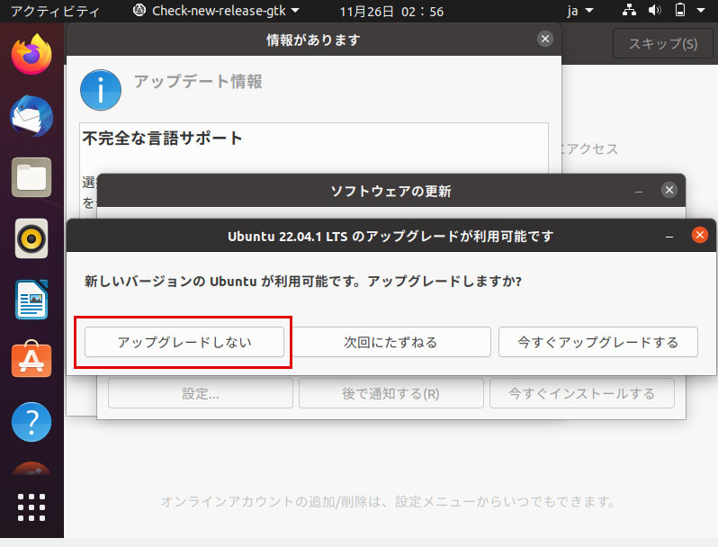


6-3.システム>マザーボードへ移動し、起動順序のフロッピーのチェックマークを外し、ネットワークに
チェックマークを入れる。
チップセットはPIIX3からICH9に変更し、拡張機能I/O APICを有効化(I)にチェックマークを入れ
る。  

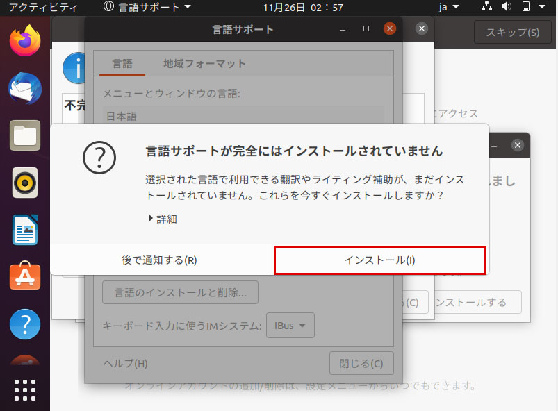


6-4.システム>プロセッサーに移動し、プロセッサー数を2に変更する。  


6-5.ストレージは、空のところを選択した状態にすると、右のディスクのマークが表示されるので
そのディスクのマークをクリックする。
いくつかリストが表示され、「仮想光学ディスクの選択/作成」を選択し、3-3移動したubuntu-ja-20.04.1-desktop-amd64.isoを選択する。  


6-6.ネットワークのアダプター1のネットワークアダプターを有効化(E)にチェックを入れておく。  
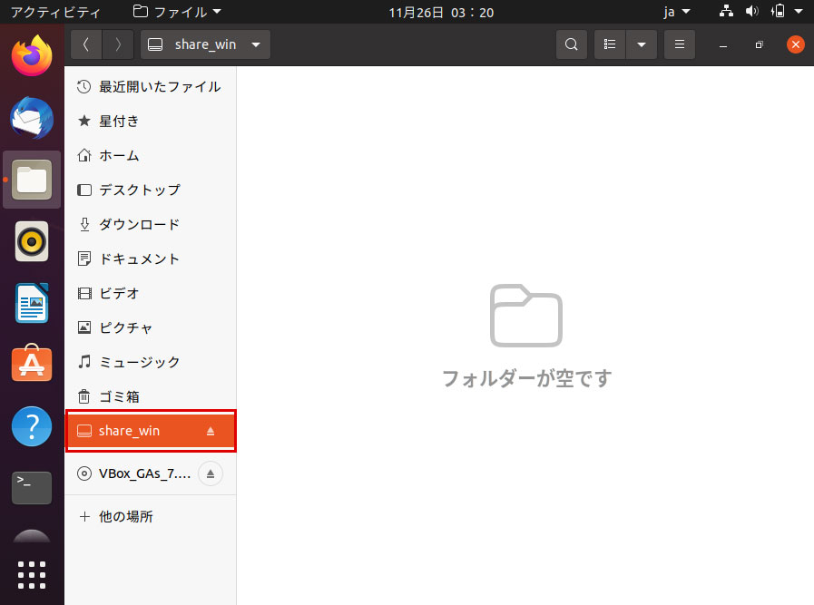


6-7.メニューから設定より共有フォルダを開きます。


6-8.下の画像のように、フォルダのパスから「その他」を選択し、ホスト PC の共有するフォルダ名を選択する。


6-9. 「自動マウント」にチェックマークを入れる。
マウントポイントは空欄で構いません。
マウントポイントの下に「永続化する」が表示されたら、こちらもチェックマークを入れる。
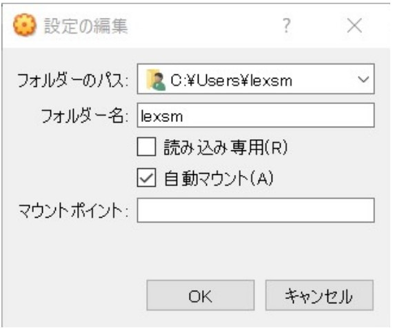

6-10.⑩OK を押した後、下の画像のような状態になる。


#### **7- Ubuntuのインストール**

7-1. 起動をクリック  


7-2. 起動ハードディスクを選択する為、3-3で移動したubuntu-ja-20.04.1-desktop-amd64.isoを選択し起動をクリック。  
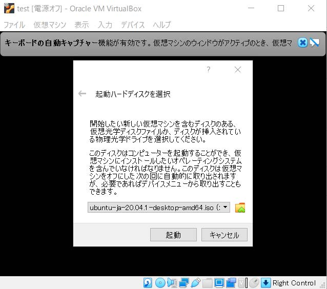


7-3. Ubuntuのインストールの準備が始まる。  
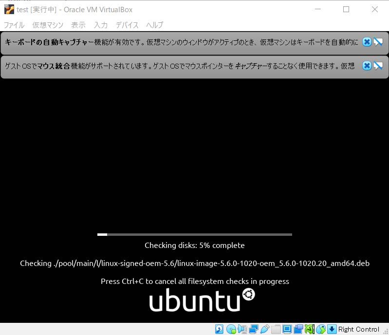


7-4. 「Ubuntuをインストール」をクリックする。  


7-5. 下の画像のまま”続ける”をクリック。  
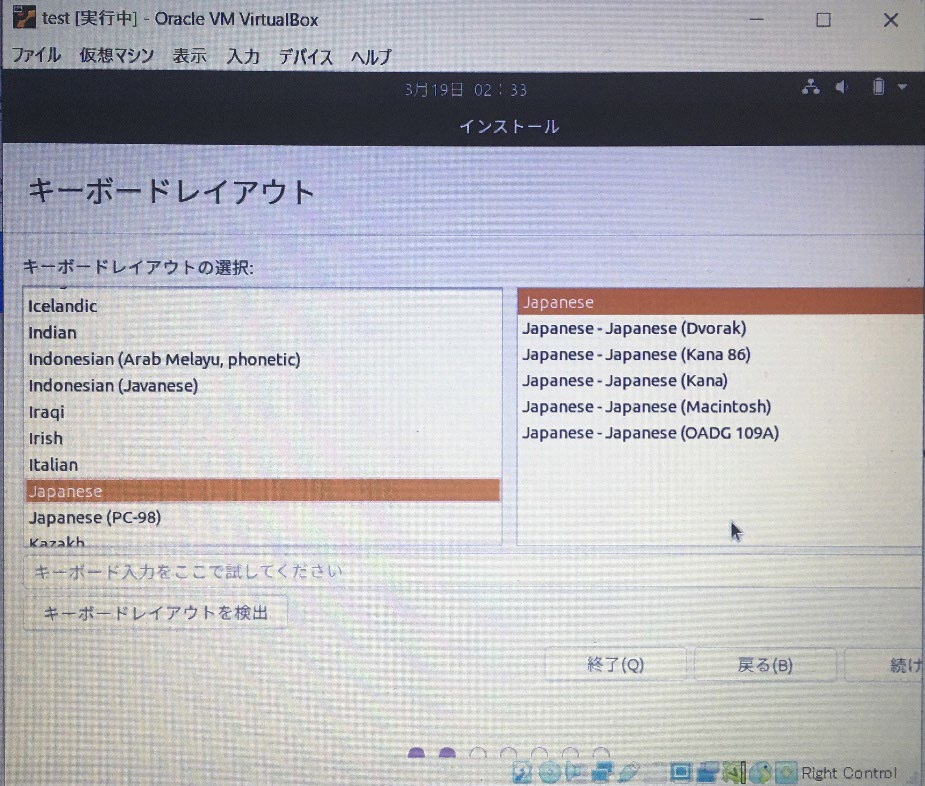

7-6. 下の画像のまま、”続ける”をクリック。  


7-7. 「ディスクを削除してUbuntuをインストール」にチェックしたまま”インストール”をクリック。  


7-8. “続ける”をクリック。  
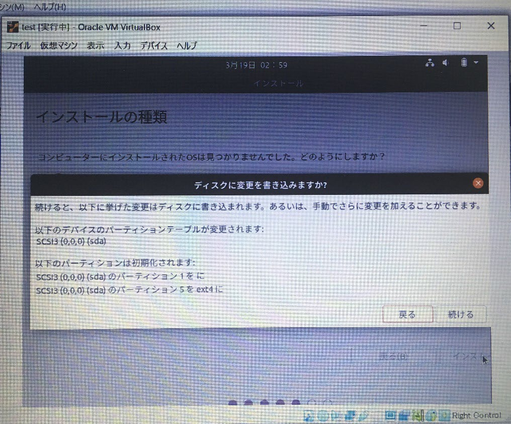


7-9. 下の画像のまま、”続ける”をクリック。  


7-10 それぞれ入力する。  


7-11 インストールが完了したので、”今すぐ再起動する”をクリック  
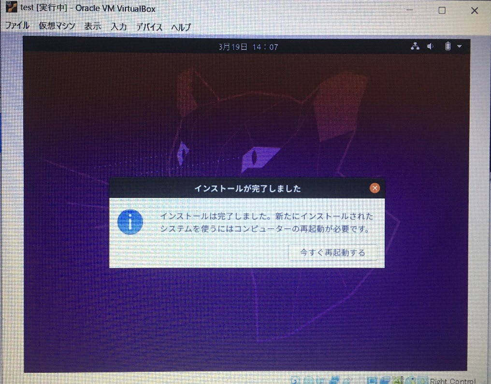


#### **8- Guest Additionsのインストール**

6-1. ホストメイン画面上部の「Devices」タブから「Insert Guest Additions CD image...」→「OK」をクリックします。

---

6-2. 以下のメッセージが表示されたら「実行」をクリックした後、パスワードを入力します。


---

6-3. 処理完了のメッセージが表示されたらEnterキーを押下します。


---
- うまくインストールできていない場合は、以下のコマンドを入力し、処理完了のメッセージが表示されたらEnterキーを押下します。

```
sudo apt install gcc make perl -y
```


---

6-4. 仮想マシンを再起動し、「View」→「Auto-resize　Guest　Display」にチェックが入っている事を確認します。

---

6-5. Guest Additionsが機能していれば「取り出す」をクリックします。


---


### Macの場合

!!! hint "貢献者"
    [[WYAM] WYAM-StakePool](https://adapools.org/pool/940d6893606290dc6b7705a8aa56a857793a8ae0a3906d4e2afd2119) Akyoさんに導入手順を作成頂きました。ありがとうございます！


**環境**  

* MacBook Pro (13-inch, 2019, Two Thunderbolt 3 ports)
* Monterey 12.2.1

**ダウンロード/インストール**  

* Ubuntu Desktop 20.04.4 LTS
* VirtualBox 6.1.14

---

#### **1- Ubuntuイメージファイルのダウンロード**

1-1. 以下のリンク先からISOイメージファイルをダウンロードします。

  - [Ubuntuを入手する](https://jp.ubuntu.com/download)  
※ ダウンロード完了まで少しかかるのでしばらくお待ちください

| ファイル名 |
| ------------- |
|ubuntu-20.04.4-desktop-amd64.iso|


---

#### **2- VirtualBoxのダウンロード/インストール**

2-1. 以下のリンク先からVirtualBoxをインストールします。

  - [VirtualBoxを入手する](https://www.virtualbox.org/wiki/Downloads)

| ファイル名 |
|-------------|
|VirtualBox-6.1.32-149290-OSX.dmg|


---

2-2. ダウンロードしたファイルをクリックし、インストールウィザードに従ってインストールします。  
完了したら「閉じる」をクリックして終了します。


> macOS BigSur 以降では、インストールしたカーネル拡張をロードできるようにするために再起動が必要です。


---

#### **3- VirtualBoxで仮想マシンを作成**
> VirtualBoxのアイコンをクリックし、起動します。  

3-1. VirtualBoxが起動したら「新規」をクリックします。


---

3-2. 以下の項目を設定し、「続き」をクリックします。  
> ※ 名前はお好みで入力してください。

| 名前 | Air-Gap-Machine |
|:-------------|:------------|
| マシンフォルダー | デフォルトでOK |
| タイプ | Linux |
| バージョン | Ubuntu（64-bit） |


  ---

3-3. 仮想マシンに割当てるメモリサイズは「`4096`MB」とし、「続き」をクリックします。


---

3-4. 「仮想ハードディスクを作成する」にチェックを入れ、「作成」をクリックします。


---

3-5. 「VDI（VirtualBox Disk Image）」にチェックを入れ、「続き」をクリックします。


---

3-6. 「固定サイズ」にチェックを入れ、「続き」をクリックします。


---

3-7. 仮想HDDファイルは「`50`GB」を入力し、「作成」をクリックします。


---

#### **4- 仮想マシンの仕様設定**

> 「OK」をクリックしたら「Oracle VM VirtualBox マネージャー」画面に遷移するので設定毎に「設定」をクリックしてください。

4-1. 歯車マークの「設定」をクリックします。


---

4-2. 「高度」タブから、以下の設定を「双方向」にし、「OK」をクリックします。


---

4-3. 「マザーボード」タブと「プロセッサー」タブを以下の設定にし、「OK」をクリックします。

| マザーボード |  |
|:-------------|:------------|
| 起動順序 | 「フロッピー」のチェックマークを外す |
| チップセット | ICH9 |
| ポインティングデバイス | PS/2マウス |

| プロセッサー |  |
|:-------------|:------------|
| プロセッサー数 | 4 |


---

4-4. 「スクリーン」タブから以下の設定にし、「OK」をクリックします。

| ビデオメモリー | 128MB |
|:-------------|:------------|
| 表示倍率 | 200% |
| グラフィックスコントローラー | VMSVGA |
| アクセラレーション | 「3Dアクセラレーションを有効化」にチェック |


---

> イメージファイルはダウンロードフォルダにあると思いますので、そちらを選択するかお好きなフォルダに移動させてください。

4-5. 「ストレージデバイス」の「空」にUbuntuのイメージを指定し、「OK」をクリックします。


---

4-6. ホスト側で共有させたいフォルダを事前に作成しておきます。  
例）「AirGap」フォルダを作成後、配下に「share」フォルダを作成。

`Mac Terminal`
```
mkdir AirGap
cd AirGap
mkdir share
```

---

4-7. 共有フォルダを指定します。


---

#### **5- 仮想マシンにUbuntuをインストール**

5-1. 仮想マシンを起動します。


> PCから権限許可を求められたら「セキュリティとプライバシー」にて必要な権限を許可し、VirtualBoxを再起動します。

---

5-2. 読み込み終了後、言語は「日本語」にし、「Install Ubuntu」をクリックします。


---

5-3. キーボード設定では、日本語キーボードの方は、両方とも「Japanese」を選択し、設定が完了したら「続ける」をクリックします。  
> USキーボードの方は「キーボードレイアウト」→「キーボードレイアウトの検出」をクリックして設定してください。  
※ 画面が見切れていた場合の対処法：Alt＋F7で移動できます)

---

5-4. 「アップデートと他のソフトウェア」の設定では、以下のように設定し、「続ける」をクリックします。


---

5-5. 「インストールの種類」の設定では「ディスクを削除してUbuntuをインストール」を選択し、「インストール」をクリックします。

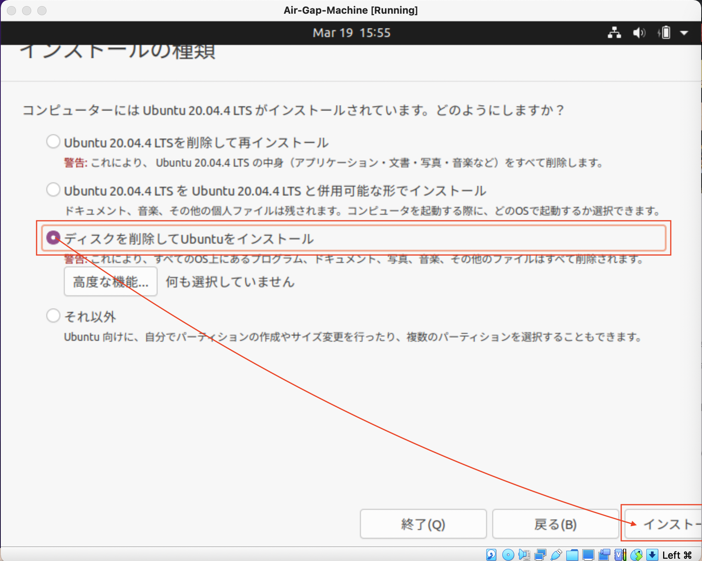

---

5-6. 「ディスクに変更を書き込みますか?」の設定では「続ける」をクリックします。


---

5-7. タイムゾーンの設定は、「Tokyo」を選択し、「続ける」をクリックします。


---

5-8. 必要な情報を入力し、「続ける」をクリックします。  
> ※ 画像は一例ですのでお好みで設定してください。


---

5-9. インストール開始。


---

5-10. インストール完了後、再起動を求められるので「今すぐ再起動する」をクリックし、Enterキーを押下します。


---

5-11. 再起動後、ユーザー名をクリックし、パスワードを入力してログインします。

---

5-12. 「オンラインアカウントへの接続」の設定では右上の「スキップ」をクリックします。


---

5-13. 「Livepatch」の設定では右上の「次へ」をクリックします。


---

5-14. 「Ubuntuの改善を支援する」の設定では、「いいえ、送信しません」を選択後、右上の「次へ」をクリックします。


---

5-15. 「プライバシー」の設定では右上の「次へ」をクリックします。


---

5-16. 「準備完了」と表示されたら右上の「完了」をクリックします。


---

#### **6- Guest Additionsのインストール**

6-1. ホストメイン画面上部の「Devices」タブから「Insert Guest Additions CD image...」→「OK」をクリックします。

---

6-2. 以下のメッセージが表示されたら「実行」をクリックした後、パスワードを入力します。


---

6-3. 処理完了のメッセージが表示されたらEnterキーを押下します。


---
- うまくインストールできていない場合は、以下のコマンドを入力し、処理完了のメッセージが表示されたらEnterキーを押下します。

```
sudo apt install gcc make perl -y
```


---

6-4. 仮想マシンを再起動し、「View」→「Auto-resize　Guest　Display」にチェックが入っている事を確認します。

---

6-5. Guest Additionsが機能していれば「取り出す」をクリックします。


---

### 共通補足

#### 共有フォルダが機能しているか確認する。

共有フォルダがきちんと機能しているかを確認しておきます。添付画像の場合、機能していないので以下のコマンドを実行します。

- 補足：マウントには成功しているが、共有フォルダにアクセスできていない場合、ゲスト側（VirtualBox内）のコマンドツールを開き、以下のコマンドを実行しましょう。この時、求められるパスワードは、VirtualBox内でのパスワードです。

```
sudo adduser $USER vboxsf
sudo reboot
```


---

#### Swapファイルの設定時のエラーについて

- 「テキストファイルがビジー状態です」と表示されたら以下を実行します。
```
sudo swapoff /swapfile
rm /swapfile
```

- [Swap領域設定](https://docs.spojapanguild.net/setup/1-ubuntu-setup/#1-7swap)

---

#### 本番運用で使用する際の注意点

- 本番運用で使用される場合は必ず「ネットワークアダプターを有効化」のチェックを外してください。

