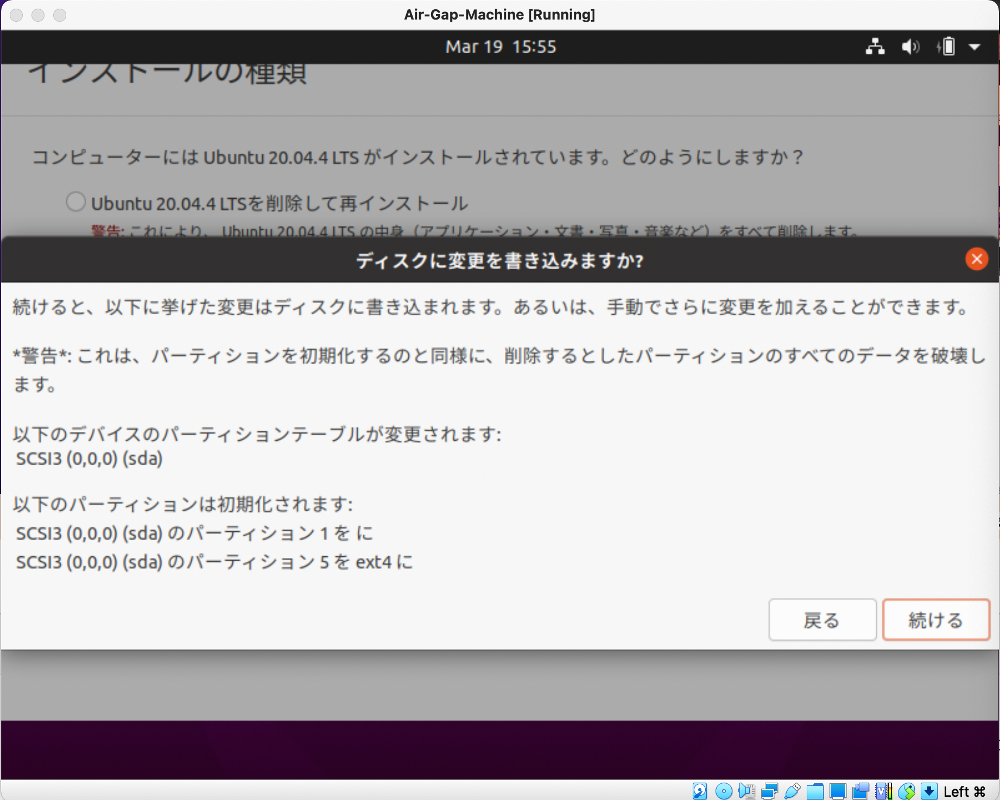

# **カルダノステークプール構築手順**


!!! info "情報"
    このマニュアルは、カルダノノードv1.35.3に対応しています。  
    最終更新日：2022年9月10日の時点guide version 12.3.5

!!! tip "サポート"
    サポートが必要な場合は、[SPO JAPAN GUILDコミュニティ](https://discord.gg/U3gU54c)で現役のSPOに質問できます


## **0-1.SPOの必須スキル**

カルダノステークプールを運営するには、以下のスキルを必要とします。

* カルダノノードを継続的にセットアップ、実行、維持する運用スキル
* ノードを24時間年中無休で維持するというコミット
* システム運用スキル
* サーバ管理スキル \(運用および保守\)
* 開発と運用経験 \(DevOps\)
* サーバ強化とセキュリティに関する知識


## **0-2.サーバースペック要件**

=== "最小構成"
    | 項目      | 要件                          |
    | :---------- | :----------------------------------- |
    | **サーバー**      | BP用1台  リレー用1台  エアギャップマシン1台  |
    | **OS**       | 64-bit Linux \(Ubuntu 20.04 LTS\) |
    | **CPU**   | 2Ghz以上 2コアのIntelまたはAMD x86プロセッサー|
    | **メモリ**    | 16GB |
    | **ストレージ**    | 150GB |
    | **ネットワーク**    | 10Mbps |
    | **帯域**    | 1時間あたり1GBの帯域 |
    | **電力**    | 24時間365日安定供給 |
    | **ADA**    | 600ADA |


=== "推奨構成"
    | 項目      | 要件                          |
    | :---------- | :----------------------------------- |
    | **サーバー**      | BP用1台  リレー用2台  エアギャップマシン1台  |
    | **OS**       | 64-bit Linux \(Ubuntu 20.04 LTS\) |
    | **CPU**   | 2Ghz以上 4コアのIntelまたはAMD x86プロセッサー|
    | **メモリ**    | 16GB over |
    | **ストレージ**    | 256GB以上 |
    | **ネットワーク**    | 100Mbps |
    | **帯域**    | 無制限 |
    | **電力**    | 24時間365日安定供給 |
    | **ADA**    | 無制限 |

### **プール構成のイメージ**

**最小構成**
``` mermaid
    flowchart BT
        a2[リレー1] <-- 開放FW --> a4[カルダノネットワーク]
        subgraph ide1[プール]
            subgraph リレーIP指定FW
                a1[BP]
            end
        a1[BP] <--> a2[リレー1]
        end
        c1[PC] --> ide1
        c1[PC] --> エアギャップ
```

**推奨構成**
``` mermaid
    flowchart BT
        a2[リレー1] & a3[リレー2] <-- 開放FW --> a4[カルダノネットワーク]
        subgraph ide1[プール]
            subgraph リレーIP指定FW
                a1[BP]
            end
                a1[BP] <--> a2[リレー1] & a3[リレー2]
        end
        c1[PC] --> ide1
        c1[PC] --> エアギャップ
```


## **0-3.お試しノード起動**

!!! hint ""
    * Linuxサーバのコマンドや、ノード起動などお試しテストでやってみたい方は、手元のパソコンでエアギャップ環境を構築し左メニューの1，2をやってみましょう！
    * この項目はブロックチェーンには直接的に影響がないので、たとえ間違ったコマンドを送信してもネットワークには問題ございません。

## **0-4.エアギャップマシンの作成**

!!! summary "エアギャップマシンとは？"
    プール運営で使用するウォレットの秘密鍵やプール運営の秘密鍵をオフライン上で管理し、エアギャップオフラインマシンでCLIを起動しトランザクションファイルに署名する作業に使用します。
    
    * ウォレットの秘密鍵やプール運営の秘密鍵をプール運営のオンラインマシン上に保管すると、ハッキングなどの際に資金盗難のリスクがあります。

### Windowsの場合

!!! hint "貢献者"
    [[SA8] SMAN8](https://adapools.org/pool/ec736597797c68044b8fccd4e895929c0a842f2e9e0a9e221b0a3026) さんに導入手順を作成頂きました。ありがとうございます！


**環境**

* Windows10/11 Home (Intel(R) Core(TM) i5-8250U CPU @ 1.60GHz   1.80 GHz)  
* 実装RAM 8.00 GB (7.90 GB 使用可能)  
* 64 ビット オペレーティング システム、x64 ベース プロセッサ  

**ダウンロード/インストール**

* Ubuntu Desktop 20.04.4 LTS  
* VirtualBox-6.1.36  
---


#### **1- VirtualBoxのダウンロード**
1-1. VirtualBoxのダウンロードサイトにアクセスし、`VirtualBox 6.1.36 platform packages`の`Windows hosts`をタップしダウンロードする。

 * [VirtualBoxの入手](https://www.virtualbox.org/wiki/Downloads)

#### **2- VirtualBoxのインストール**

2-1.ダウンロードしたvirtualbox6.1.36のインストーラをダブルクリックで起動する。

| ファイル名 |
| ------------- |
|VirtualBox-6.1.36-152435-Win.exe|


2-2.ダウンロードが完了したら、左下の赤い四角のインストーラーをタップして起動する。


2-3.この画面になったら、`Next>`をタップ。


2-4.続けてそのまま`Next>`をタップし、下の画面になったら`Install`をタップする。


2-5.Windowsセキュリティが作動し、デバイスのソフトウェアをインストールしますか？と聞かれたら`インストール(I)`をタップし、下の画像の赤い四角で囲まれた`Finish`をタップする。


2-6.VirtualBoxの管理画面が立ち上がり、インストールが完了しました。


#### **3- OS Ubuntuの入手**
3-1.下の画像の赤い四角のところをタップしてダウンロードします。

- [Ubuntu20.04.4 LTSの入手](https://releases.ubuntu.com/20.04/)


3-2.ダウンロードしたubuntu-20.04.4-desktop-amd64を作成したフォルダ(ここではTest_CNodeというフォルダ)に移動しておく。


#### **4- VirtualBoxのインストール後の環境設定**
4-1.マシンを作成する為に下の画像の赤い四角の`新規(N)`をタップする。


4-2.名前とオペレーティングシステムの画面になったら、①マシンの名前、②マシンのフォルダーパス指定、③Linux、④Linux(64bit)を選択する。


4-3.メモリサイズは、4GB(4000MB)に変更する。


4-4.下の画像の状態で「仮想ハードディスクを作成する(C)」を選択した状態のまま下の`作成`をタップ。


4-5.「VDI(VirtualBox Disc Image)」の状態のまま、`次へ(N)`をタップ。


4-6.「可変サイズ(D)」の状態のまま`次へ(N)`をタップ。


4-7.ハードディスクのサイズを50GBに変更し`作成`をタップ。


4-8.おめでとうございます！仮想マシンが作成されました。


#### **5- VirtualBoxの仮想マシンの作成**

5-1.VirtualBoxが終了している状態から、下の画像の四角をダブルクリックして、VirtualBoxを起動する。


5-2.ファイル > `環境設定(P)...`をタップ。


5-3.一般 > デフォルトの仮想マシンフォルダー(M)の 下の画像の赤い四角をタップし`その他`を選択。


5-4.仮想マシンの関連ファイル等の置き場所を決める為、フォルダ(ここではTest_CNodeフォルダ)を選択し、`OK`をタップし環境設定を完了する。


#### **6- VirtualBoxの仮想マシンの環境設定**

6-1.対象の仮想マシンを選択したまま、赤い四角の線に囲まれた`設定`をタップ。


6-2.一般 > 高度(A)へと移動し、クリップボードの共有とドラック&ドロップを`無効`から`双方向`へ変更する。


6-3.次に、システム > マザーボード(M)へ移動し、起動順序の`フロッピー`のチェックマークを外し、`ネットワーク`にチェックマークを入れる。その他は、デフォルトのままで良い。


6-4.システム > プロセッサー(P)に移動し、プロセッサー数(P)を`2`に変更する。※ディスクを起動してUbuntuのインストールの際にKernelPanicで先に進めない状況になるので、ご自身のPC状況に応じて2以上に設定して下さい。


6-5.ストレージに移動し、赤い四角の`空`を選択したまま、右の赤い四角のディスクのようなマークが表示されるので、そのディスクマークをタップする。


6-6.ディスクマークをタップしたら、`ディスクファイルを選択...`を選択。


6-7.3-2で移動したフォルダを選択して、Ubuntu-20.04.4-desktop-amd64を選択する。


6-8.ネットワークのアダプター1の`ネットワークアダプターを有効化(E)`にチェックを入れておく。**※全てのセッティングが終わった後、セキュリティを堅牢にする為、チェックマークを外したままKESの更新作業等を行う。**


6-9.**共有フォルダの設定** です。メニュー > 共有フォルダーをタップ。


6-10.下の画像のように、フォルダのパスから「その他」を選択し、**ホストPCにある共有するフォルダ名**を選択する。


※ホスト側でのフォルダを追加して作成する事も可能です。

6-11.フォルダーのパスのところには、ホストPCに用意してある共有フォルダを選択する。すると自動で下のスペースの`フォルダ名`にも追加される。そして、自動マウントにチェックを入れる。


6-12.`OK`すると下の画像のようになる。


**※共有フォルダの機能が有効になる為には他の設定が必要になります。とりあえず、仮想マシンの環境設定を完了してます。**


#### **7- Ubuntuのインストール**

7-1.`起動`をタップ。


7-2.VirtualBoxの環境設定や仮想マシンのストレージの設定により下の画像がスキップされることがある。もし、下の画像の表示があれば3-2のディスクを選択し、`起動`をタップ。


7-3.下の画像のようにディスクが起動し始めます。


7-4.左の枠の中から`日本語`を選択し`Ubuntuをインストール`をタップします。


7-5.そのまま`続ける`をタップ。


7-6.下の画像の状態のまま、`続ける`をタップ


7-7.下の画像の状態のまま、`インストール`をタップ。


7-8.`続ける`をタップします。


7-9.下の画像の状態のまま、`続ける`をタップします。


7-10.`あなたの名前`はマシン名を入れると、その下の`コンピューターの名前`、`ユーザー名の入力`にも自動で入力されます。そして、パスワードをご自身で決めて入力を済ませて下さい。終わりましたら、`続ける`をタップ。


7-11.Ubuntuのインストールが始まりました。しばらくお待ちください。


7-12.しばらく、お待ちください。


7-13.画面が切り替わります。


7-14.この画像になりましたら、右上の`スキップ(S)`をタップします。


7-15.`次へ`をタップします。


7-16.そのまま、`次へ（N)`をタップ。


7-17.`いいえ、送信しません`を選択し、右上の`次へ(N)`をタップします。


7-18.インストールが終わりました。`今すぐ再起動する`をタップして下さい。


7-19.再起動後、ソフトウェアの更新案内があるので、`今すぐインストールする`をタップ。


7-20.ソフトウェアの更新が完了したら、`すぐに再起動`する。


7-21.Ubuntuで`端末`を起動し、下のコマンドを実行する。

>Guest Additionsがインストールされていない状態なのでホストからゲストにコピーアンドペーストできません。タイプミスに留意してください。
また以下の手順を行なっても、共有フォルダがGUIで表示されない、共有フォルダ化されていない場合は、一度VBox_GAs_6.1.36をアンマウントしてから再度挿入し、再起動すると共有フォルダは完了します。 それでもダメなら[GUI操作でGuest Additionsがインストールできなかった場合](./0-start-guide.md#guiguest-additions)を試してください。

```
sudo apt updata -y
sudo apt upgrade -y
sudo apt install gcc make perl -y
```

#### **8- Guest Additionsのインストール**

8-1.ホストメイン画面上部の「Devices」タブから「Insert Guest Additions CD image...」⇒`OK`をクリックします。


8-2.以下のメッセージが表示されたら`実行`をクリックした後、パスワードを入力します。


8-3処理完了のメッセージが表示されましたら`Enter`キーをタップします。


8-4.ユーザーをグループ化するコマンドを実行。

```
sudo adduser <ユーザー名> vboxsf
```

8-5.共有フォルダが作成できたか下の画像のように表示されていればOK、コピー＆ペーストできるかホストPCでコマンドを`コピー`してゲストOSの端末で右クリックして`貼り付け`してみる。問題なければ、これで終了です。お疲れ様でした！


---


### Macの場合

!!! hint "貢献者"
    [[WYAM] WYAM-StakePool](https://adapools.org/pool/940d6893606290dc6b7705a8aa56a857793a8ae0a3906d4e2afd2119) Akyoさんに導入手順を作成頂きました。ありがとうございます！


**環境**  

* MacBook Pro (13-inch, 2019, Two Thunderbolt 3 ports)
* Monterey 12.5

**ダウンロード/インストール**  

* Ubuntu Desktop 20.04.4 LTS
* VirtualBox 6.1.14

---

#### **1- Ubuntuイメージファイルのダウンロード**

1-1. 以下のリンク先からISOイメージファイルをダウンロードします。

  - [Ubuntuを入手する](https://releases.ubuntu.com/20.04/)  
※ ダウンロード完了まで少しかかるのでしばらくお待ちください

| ファイル名 |
| ------------- |
|ubuntu-20.04.4-desktop-amd64.iso|


---

#### **2- VirtualBoxのダウンロード/インストール**

2-1. 以下のリンク先からVirtualBoxをインストールします。

  - [VirtualBoxを入手する](https://www.virtualbox.org/wiki/Downloads)

| ファイル名 |
|-------------|
|VirtualBox-6.1.36-152435-OSX.dmg|


---

2-2. ダウンロードしたファイルをクリックし、インストールウィザードに従ってインストールします。完了したら「閉じる」をクリックして終了します。


> macOS BigSur 以降では、インストールしたカーネル拡張をロードできるようにするために再起動が必要です。


---

#### **3- VirtualBoxで仮想マシンを作成**
> VirtualBoxのアイコンをクリックし、起動します。  

3-1. VirtualBoxが起動したら「新規」をクリックします。


---

3-2. 以下の項目を設定し、「続き」をクリックします。  
> ※ 名前はお好みで入力してください。

| 名前 | Air-Gap-Machine |
|:-------------|:------------|
| マシンフォルダー | デフォルトでOK |
| タイプ | Linux |
| バージョン | Ubuntu（64-bit） |


  ---

3-3. 仮想マシンに割当てるメモリサイズは「`4096`MB」とし、「続き」をクリックします。


---

3-4. 「仮想ハードディスクを作成する」にチェックを入れ、「作成」をクリックします。


---

3-5. 「VDI（VirtualBox Disk Image）」にチェックを入れ、「続き」をクリックします。


---

3-6. 「固定サイズ」にチェックを入れ、「続き」をクリックします。


---

3-7. 仮想HDDファイルは「`50`GB」を入力し、「作成」をクリックします。


---

#### **4- 仮想マシンの仕様設定**

> 「OK」をクリックしたら「Oracle VM VirtualBox マネージャー」画面に遷移するので設定毎に「設定」をクリックしてください。

<br><br>
<span style="font-size: 200%;"><u>一般</u></span>

4-1. 歯車マークの「設定」をクリックします。


---

4-2. 「高度」タブから、以下の設定を「双方向」にし、「OK」をクリックします。


---

<span style="font-size: 200%;"><u>システム</u></span>

4-3. 「マザーボード」タブと「プロセッサー」タブを以下の設定にし、「OK」をクリックします。

| マザーボード |  |
|:-------------|:------------|
| 起動順序 | 「フロッピー」のチェックマークを外す |
| チップセット | ICH9 |
| ポインティングデバイス | PS/2マウス |

| プロセッサー |  |
|:-------------|:------------|
| プロセッサー数 | 4 |


---

<span style="font-size: 200%;"><u>ディスプレイ</u></span>

4-4. 「スクリーン」タブから以下の設定にし、「OK」をクリックします。

| ビデオメモリー | 128MB |
|:-------------|:------------|
| 表示倍率 | 200% |
| グラフィックスコントローラー | VMSVGA |
| アクセラレーション | 「3Dアクセラレーションを有効化」にチェック |


---
<span style="font-size: 200%;"><u>ストレージ</u></span>

> イメージファイルはダウンロードフォルダにあると思いますので、そちらを選択するかお好きなフォルダに移動させてください。

4-5. 「ストレージデバイス」の「空」にUbuntuのイメージを指定し、「OK」をクリックします。


---

<span style="font-size: 200%;"><u>共有フォルダ</u></span>

4-6. ホスト側で共有させたいフォルダを事前に作成しておきます。  
例）「AirGap」フォルダを作成後、配下に「share」フォルダを作成。

`Mac Terminal`
```
mkdir -p $HOME/AirGap/share
```

---

4-7. 共有フォルダを指定します。


---

#### **5- 仮想マシンにUbuntuをインストール**

5-1. 仮想マシンを起動します。


> PCから権限許可を求められたら「セキュリティとプライバシー」にて必要な権限を許可し、VirtualBoxを再起動します。

---

5-2. 読み込み終了後、言語は「日本語」にし、「Install Ubuntu」をクリックします。


---

5-3. キーボード設定では、日本語キーボードの方は、両方とも「Japanese」を選択し、設定が完了したら「続ける」をクリックします。  
> USキーボードの方は「キーボードレイアウト」→「キーボードレイアウトの検出」をクリックして設定してください。  
※ 画面が見切れていた場合の対処法：Alt＋F7で移動できます)

---

5-4. 「アップデートと他のソフトウェア」の設定では、以下のように設定し、「続ける」をクリックします。


---

5-5. 「インストールの種類」の設定では「ディスクを削除してUbuntuをインストール」を選択し、「インストール」をクリックします。


---

5-6. 「ディスクに変更を書き込みますか?」の設定では「続ける」をクリックします。



---

5-7. タイムゾーンの設定は、「Tokyo」を選択し、「続ける」をクリックします。


---

5-8. 必要な情報を入力し、「続ける」をクリックします。  
> ※ 画像は一例ですのでお好みで設定してください。


---

5-9. インストール開始。


---

5-10. インストール完了後、再起動を求められるので「今すぐ再起動する」をクリックし、Enterキーを押下します。


---

5-11. 再起動後、ユーザー名をクリックし、パスワードを入力してログインします。

---

5-12. 「オンラインアカウントへの接続」の設定では右上の「スキップ」をクリックします。


---

5-13. 「Livepatch」の設定では右上の「次へ」をクリックします。


---

5-14. 「Ubuntuの改善を支援する」の設定では、「いいえ、送信しません」を選択後、右上の「次へ」をクリックします。


---

5-15. 「プライバシー」の設定では右上の「次へ」をクリックします。


---

5-16. 「準備完了」と表示されたら右上の「完了」をクリックします。


---

#### **6- Guest Additionsのインストール**

6-1. ターミナルを開いて以下を実行します。

>Guest Additionsがインストールされていない状態なのでホストからゲストにコピーアンドペーストできません。タイプミスに留意してください。
また以下の手順を行なっても、共有フォルダがGUIで表示されない、共有フォルダ化されていない場合は、一度VBox_GAs_6.1.36をアンマウントしてから再度挿入し、再起動すると共有フォルダは完了します。 それでもダメなら[GUI操作でGuest Additionsがインストールできなかった場合](./0-start-guide.md#guiguest-additions)を試してください。

```
sudo apt update -y
sudo apt upgrade -y
sudo apt install gcc make perl -y
```

---

6-2. ホストメイン画面上部の「Devices」タブから「Insert Guest Additions CD image...」→「OK」をクリックします。

---

6-2. 以下のメッセージが表示されたら「実行」をクリックした後、パスワードを入力します。


---

6-3. 処理完了のメッセージが表示されたらEnterキーを押下します。


---
6-4. 処理完了のメッセージが表示されたらEnterキーを押下します。


---

6-4. 仮想マシンを再起動し、「View」→「Auto-resize　Guest　Display」にチェックが入っている事を確認します。

---

6-5. ユーザーをvboxsfグループに追加して再起動します。

```
sudo adduser $USER vboxsf
sudo reboot
```

6-6. 「View」→「Auto-resize　Guest　Display」にチェックが入っている事を確認します。
>確認後、右クリック→「取り出す」をクリックします。


---

6-7. テストファイル作成
ターミナルを開いて以下を実行します。
>共有フォルダにテストファイルを作成してホスト側で確認できたら成功です。

```
touch /media/sf_share/test
```


### 共通補足

#### GUI操作でGuest Additionsがインストールできなかった場合

Virtualbox guest addition packagesをインストールします。
> ターミナルを開いて以下のコマンドを実行してください。  
> Guest Additionsがインストールされていない状態なのでホストからゲストにコピーアンドペーストできません。タイプミスに留意してください。  
> 成功していれば再起動後、コピーアンドペーストできます。
```console
sudo apt update -y
sudo apt upgrade -y
sudo add-apt-repository multiverse
sudo apt install virtualbox-guest-dkms virtualbox-guest-x11 -y
```

ユーザーを`vboxsf`グループに追加して再起動します。
```console
sudo adduser $USER vboxsf
sudo reboot
```

共有フォルダが追加されているか確認
```console
df
```
> `share`          488245288 203122832 285122456  42% `/media/sf_share`

共有フォルダのグループを確認
```console
ls -l /media
```
> drwxrwx--- 1 root `vboxsf` 96  x月 xx xx:xx sf_share

テストファイル作成  
> 共有フォルダにテストファイルを作成してホスト側で確認できたら成功です。

```console
touch /media/sf_share/test
```

---

#### Swapファイルの設定時のエラーについて

- 「テキストファイルがビジー状態です」と表示されたら以下を実行します。
```
sudo swapoff /swapfile
rm /swapfile
```

- [Swap領域設定](https://docs.spojapanguild.net/setup/1-ubuntu-setup/#1-7swap)

---

#### 本番運用で使用する際の注意点

- 本番運用で使用される場合は必ず「ネットワークアダプターを有効化」のチェックを外してください。

