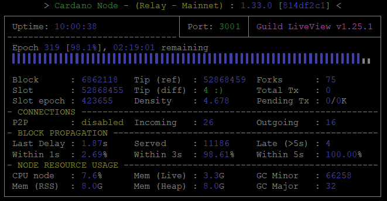

# **2. ノードインストール**

## **2-1. Cabal/GHCインストール**

ターミナルを起動し、以下のコマンドを入力しましょう！

まずはじめに、パッケージを更新しUbuntuを最新の状態に保ちます。

```bash
sudo apt update -y
```
```bash
sudo apt upgrade -y
```
```bash
sudo apt install git jq bc automake tmux rsync htop curl build-essential pkg-config libffi-dev libgmp-dev libssl-dev libtinfo-dev libsystemd-dev zlib1g-dev make g++ wget libncursesw5 libtool autoconf -y
```

次に、Libsodiumをインストールします。

```bash
mkdir $HOME/git
cd $HOME/git
git clone https://github.com/input-output-hk/libsodium
cd libsodium
git checkout 66f017f1
./autogen.sh
./configure
make
sudo make install
```

GHCUPをインストールします。

```bash
cd $HOME
curl --proto '=https' --tlsv1.2 -sSf https://get-ghcup.haskell.org | sh
```

!!! note ""
    戻り値対応

> Press ENTER to proceed or ctrl-c to abort.
Note that this script can be re-run at any given time.

⇒Enter

> Detected bash shell on your system...
Do you want ghcup to automatically add the required PATH variable to "/home/btalonzo/.bashrc"?

> [P] Yes, prepend  [A] Yes, append  [N] No  [?] Help (default is "P").

⇒Pと入力しEnter

> Do you want to install haskell-language-server (HLS)?
HLS is a language-server that provides IDE-like functionality
and can integrate with different editors, such as Vim, Emacs, VS Code, Atom, ...
Also see https://github.com/haskell/haskell-language-server/blob/master/README.md

> [Y] Yes  [N] No  [?] Help (default is "N").

⇒Nと入力しEnter

> Do you want to install stack?
Stack is a haskell build tool similar to cabal that is used by some projects.
Also see https://docs.haskellstack.org/

>[Y] Yes  [N] No  [?] Help (default is "N").

⇒Nと入力しEnter

> Press ENTER to proceed or ctrl-c to abort.
Installation may take a while.

⇒Enter

ghcupセットアップ確認
```bash
source ~/.bashrc
ghcup upgrade
ghcup install cabal 3.4.0.0
ghcup set cabal 3.4.0.0
```

GHCをインストールします。

```bash
ghcup install ghc 8.10.7
ghcup set ghc 8.10.7
```

環境変数を設定しパスを通します。  
ノード設定ファイルは **$NODE\_HOME**(例：/home/user/cnode) に設定されます。

```bash
echo PATH="$HOME/.local/bin:$PATH" >> $HOME/.bashrc
echo export LD_LIBRARY_PATH="/usr/local/lib:$LD_LIBRARY_PATH" >> $HOME/.bashrc
echo export NODE_HOME=$HOME/cnode >> $HOME/.bashrc
echo export NODE_CONFIG=mainnet>> $HOME/.bashrc
echo export NODE_BUILD_NUM=$(curl https://hydra.iohk.io/job/Cardano/iohk-nix/cardano-deployment/latest-finished/download/1/index.html | grep -e "build" | sed 's/.*build\/\([0-9]*\)\/download.*/\1/g') >> $HOME/.bashrc
source $HOME/.bashrc
```

バージョン確認

```bash
cabal update
cabal --version
ghc --version
```

!!! check "チェック"
    Cabalバージョン：「3.4.0.0」  
    GHCバージョン：「8.10.7」であることを確認してください。


## **2-2. ソースコードからビルド**

!!! info "確認"
    バイナリーファイルは必ずソースコードからビルドするようにし、整合性をチェックしてください。  
    IOGは現在ARMアーキテクチャ用のバイナリファイルを提供していません。Raspberry Piを使用してプールを構築する場合は、ARM用コンパイラでコンパイルする必要があります。


Gitからソースコードをダウンロードし、最新のタグに切り替えます。

```bash
cd $HOME/git
git clone https://github.com/input-output-hk/cardano-node.git
cd cardano-node
git fetch --all --recurse-submodules --tags
git checkout tags/1.33.0
```

Cabalのビルドオプションを構成します。

```bash
cabal configure -O0 -w ghc-8.10.7
```

Cabal構成、プロジェクト設定を更新し、ビルドフォルダーをリセットします。

```bash
echo -e "package cardano-crypto-praos\n flags: -external-libsodium-vrf" > cabal.project.local
sed -i $HOME/.cabal/config -e "s/overwrite-policy:/overwrite-policy: always/g"
rm -rf $HOME/git/cardano-node/dist-newstyle/build/x86_64-linux/ghc-8.10.7
```

カルダノノードをビルドします。

```sh
cabal build cardano-cli cardano-node
```

!!! info "ヒント"
    サーバスペックによって、ビルド完了までに数分から数時間かかる場合があります。


**cardano-cli**ファイルと **cardano-node**ファイルをbinディレクトリにコピーします。

```bash
sudo cp $(find $HOME/git/cardano-node/dist-newstyle/build -type f -name "cardano-cli") /usr/local/bin/cardano-cli
```
```bash
sudo cp $(find $HOME/git/cardano-node/dist-newstyle/build -type f -name "cardano-node") /usr/local/bin/cardano-node
```

**cardano-cli** と **cardano-node**のバージョンが最新Gitタグバージョンであることを確認してください。

```text
cardano-node version
cardano-cli version
```

最新バージョン確認コマンド
```
curl -s https://api.github.com/repos/input-output-hk/cardano-node/releases/latest | jq -r .tag_name
```

## **2-3. ノード設定ファイルの修正**

ノード構成に必要な設定ファイルを取得します。  
config.json、genesis.json、topology.json

```bash
mkdir $NODE_HOME
cd $NODE_HOME
wget -N https://hydra.iohk.io/build/${NODE_BUILD_NUM}/download/1/${NODE_CONFIG}-byron-genesis.json
wget -N https://hydra.iohk.io/build/${NODE_BUILD_NUM}/download/1/${NODE_CONFIG}-topology.json
wget -N https://hydra.iohk.io/build/${NODE_BUILD_NUM}/download/1/${NODE_CONFIG}-shelley-genesis.json
wget -N https://hydra.iohk.io/build/${NODE_BUILD_NUM}/download/1/${NODE_CONFIG}-alonzo-genesis.json
wget -N https://hydra.iohk.io/build/${NODE_BUILD_NUM}/download/1/${NODE_CONFIG}-config.json
```

以下のコードを実行し **config.json**ファイルを更新します。  

* TraceBlockFetchDecisionsを「true」に変更します。

```bash
sed -i ${NODE_CONFIG}-config.json \
    -e "s/TraceBlockFetchDecisions\": false/TraceBlockFetchDecisions\": true/g"
```

環境変数を追加し、.bashrcファイルを更新します。

```bash
echo export CARDANO_NODE_SOCKET_PATH="$NODE_HOME/db/socket" >> $HOME/.bashrc
source $HOME/.bashrc
```

## **2-4. ノード起動スクリプトの作成**

起動スクリプトには、ディレクトリ、ポート番号、DBパス、構成ファイルパス、トポロジーファイルパスなど、カルダノノードを実行するために必要な変数が含まれています。

全行をコピーしコマンドラインに送信します。

=== "リレーノード"

    ```bash
    cat > $NODE_HOME/startRelayNode1.sh << EOF 
    #!/bin/bash
    DIRECTORY=$NODE_HOME
    PORT=6000
    HOSTADDR=0.0.0.0
    TOPOLOGY=\${DIRECTORY}/${NODE_CONFIG}-topology.json
    DB_PATH=\${DIRECTORY}/db
    SOCKET_PATH=\${DIRECTORY}/db/socket
    CONFIG=\${DIRECTORY}/${NODE_CONFIG}-config.json
    /usr/local/bin/cardano-node run --topology \${TOPOLOGY} --database-path \${DB_PATH} --socket-path \${SOCKET_PATH} --host-addr \${HOSTADDR} --port \${PORT} --config \${CONFIG}
    EOF
    ```


=== "ブロックプロデューサーノード"

    ```bash
    cat > $NODE_HOME/startBlockProducingNode.sh << EOF 
    #!/bin/bash
    DIRECTORY=$NODE_HOME
    PORT=6000
    HOSTADDR=0.0.0.0
    TOPOLOGY=\${DIRECTORY}/${NODE_CONFIG}-topology.json
    DB_PATH=\${DIRECTORY}/db
    SOCKET_PATH=\${DIRECTORY}/db/socket
    CONFIG=\${DIRECTORY}/${NODE_CONFIG}-config.json
    /usr/local/bin/cardano-node run --topology \${TOPOLOGY} --database-path \${DB_PATH} --socket-path \${SOCKET_PATH} --host-addr \${HOSTADDR} --port \${PORT} --config \${CONFIG}
    EOF
    ```


## **2-5. ノード起動**

起動スクリプトに実行権限を付与し、ブロックチェーンの同期を開始します。 
   
**リレーノードから実施します。**


=== "リレーノード"

    ```bash
    cd $NODE_HOME
    chmod +x startRelayNode1.sh
    ./startRelayNode1.sh
    ```


=== "ブロックプロデューサーノード"

    ```bash
    cd $NODE_HOME
    chmod +x startBlockProducingNode.sh
    ./startBlockProducingNode.sh
    ```

!!! info ""
    勢いよくログが流れていたら起動成功です  


一旦ノードを停止します。
```
Ctrl+C
```

## **2-6. 自動起動の設定(systemd)**

先程のスクリプトだけでは、ターミナル画面を閉じるとノードが終了してしまうので、スクリプトをサービスとして登録し、自動起動するように設定しましょう

!!! hint "ステークプールにsystemdを使用するメリット"

    1. メンテナンスや停電など、自動的にコンピュータが再起動したときステークプールを自動起動します。
    2. クラッシュしたステークプールプロセスを自動的に再起動します。
    3. ステークプールの稼働時間とパフォーマンスをレベルアップさせます。

始める前にステークプールが停止しているか確認してください。

```bash
killall -s 2 cardano-node
```

以下のコードを実行して、ユニットファイルを作成します。


=== "リレーノード"

    ```bash
    cat > $NODE_HOME/cardano-node.service << EOF 
    # The Cardano node service (part of systemd)
    # file: /etc/systemd/system/cardano-node.service 

    [Unit]
    Description     = Cardano node service
    Wants           = network-online.target
    After           = network-online.target 

    [Service]
    User            = ${USER}
    Type            = simple
    WorkingDirectory= ${NODE_HOME}
    ExecStart       = /bin/bash -c '${NODE_HOME}/startRelayNode1.sh'
    KillSignal=SIGINT
    RestartKillSignal=SIGINT
    TimeoutStopSec=300
    LimitNOFILE=32768
    Restart=always
    RestartSec=5
    SyslogIdentifier=cardano-node

    [Install]
    WantedBy	= multi-user.target
    EOF
    ```

=== "ブロックプロデューサーノード"

    ```bash
    cat > $NODE_HOME/cardano-node.service << EOF 
    # The Cardano node service (part of systemd)
    # file: /etc/systemd/system/cardano-node.service 

    [Unit]
    Description     = Cardano node service
    Wants           = network-online.target
    After           = network-online.target 

    [Service]
    User            = ${USER}
    Type            = simple
    WorkingDirectory= ${NODE_HOME}
    ExecStart       = /bin/bash -c '${NODE_HOME}/startBlockProducingNode.sh'
    KillSignal=SIGINT
    RestartKillSignal=SIGINT
    TimeoutStopSec=300
    LimitNOFILE=32768
    Restart=always
    RestartSec=5
    SyslogIdentifier=cardano-node

    [Install]
    WantedBy	= multi-user.target
    EOF
    ```

`/etc/systemd/system`にユニットファイルをコピーして、権限を付与します。

```bash
sudo cp $NODE_HOME/cardano-node.service /etc/systemd/system/cardano-node.service
```

```bash
sudo chmod 644 /etc/systemd/system/cardano-node.service
```

次のコマンドを実行して、OS起動時にサービスの自動起動を有効にします。

```text
sudo systemctl daemon-reload
sudo systemctl enable cardano-node
sudo systemctl start cardano-node
```
**システム起動後に、ログモニターを表示します**

```text
journalctl --unit=cardano-node --follow
```
> コマンド入力に戻る場合は「Ctrl＋C」（この場合ノードは終了しません）

!!! hint "ヒント"
    スクリプトへのパスを通し、任意の単語で起動出来るようにする。
    ```bash
    echo alias cnode='"journalctl -u cardano-node -f"' >> $HOME/.bashrc
    source $HOME/.bashrc
    ```

    単語を入力するだけで、起動状態(ログ)を確認できます。  
    ```
    cnode
    ```


## **2-7. gLiveViewのインストール**

cardano-nodeはログが流れる画面だけでは何が表示されているのかよくわかりません。  
それを視覚的に確認できるツールが**gLiveView**です。


!!! info ""
    gLiveViewは重要なノードステータス情報を表示し、systemdサービスとうまく連携します。このツールを作成した [Guild Operators](https://cardano-community.github.io/guild-operators/#/Scripts/gliveview) の功績によるものです。


Guild LiveViewをインストールします。

```bash
mkdir $NODE_HOME/scripts
cd $NODE_HOME/scripts
sudo apt install bc tcptraceroute -y
curl -s -o gLiveView.sh https://raw.githubusercontent.com/cardano-community/guild-operators/master/scripts/cnode-helper-scripts/gLiveView.sh
curl -s -o env https://raw.githubusercontent.com/cardano-community/guild-operators/master/scripts/cnode-helper-scripts/env
chmod 755 gLiveView.sh
```

**env** ファイル内の定義を修正します

```bash
sed -i $NODE_HOME/scripts/env \
    -e '1,73s!#CNODE_HOME="/opt/cardano/cnode"!CNODE_HOME=${NODE_HOME}!' \
    -e '1,73s!#CNODE_PORT=6000!CNODE_PORT=6000!' \
    -e '1,73s!#CONFIG="${CNODE_HOME}/files/config.json"!CONFIG="${CNODE_HOME}/mainnet-config.json"!' \
    -e '1,73s!#SOCKET="${CNODE_HOME}/sockets/node0.socket"!SOCKET="${CNODE_HOME}/db/socket"!'
```
!!! warning "ポート修正"
    ノードのポート番号を6000以外に設定している場合は、個別にenvファイルを開いてポート番号を修正してください。
    
Guild Liveviewを起動します。

```text
./gLiveView.sh
```



??? info "gLiveViewについて▼"
    * **このツールを立ち上げてもノードは起動しません。ノードは別途起動しておく必要があります**  
    * リレー／BPの自動判別は、手順4-5終了後に行われるようになります。 
    * リレーノードでは基本情報に加え、トポロジー接続状況を確認できます。  
    * BPノードでは基本情報に加え、KES有効期限、ブロック生成状況を確認できます。  

??? hint "CONECTIONSについて▼"
    ノードにpingを送信する際ICMPpingを使用します。接続先ノードのファイアウォールがICMPトラフィックを受け付ける場合のみ機能します。


!!! warning "重要：ノード同期について"
    0エポックからブロックチェーンデータをダウンロードし同期します。最新エポックまで追いつくまでに1日半～2日かかり、完全に同期するまで次の項目には進めません。
    BPサーバーや2つ目のリレーサーバーでも同じ作業を実施してください。

!!! hint "ヒント"
    スクリプトへのパスを通し、任意の単語で起動出来るようにする。
    ```bash
    echo alias glive="$NODE_HOME/scripts/gLiveView.sh" >> $HOME/.bashrc
    source $HOME/.bashrc
    ```

    単語を入力するだけで、どこからでも起動できます。   
    glive・・・gLiveView.sh  

## **2-8. エアギャップオフラインマシンの作成**
!!! info "エアギャップマシンとは？"

    エアギャップオフラインマシンは「コールド環境」と呼ばれコンピュータネットワークにおいてセキュリティを高める方法の一つ。 安全にしたいコンピュータやネットワークを、インターネットや安全でないLANといったネットワークから物理的に隔離することを指す。

    * プール運営においてコールドキーを管理し、トランザクション署名ファイルを作成します。
    * キーロギング攻撃、マルウエア／ウイルスベースの攻撃、その他ファイアウォールやセキュリティーの悪用から保護します。
    * 有線・無線のインターネットには接続しないでください。
    * ネットワーク上にあるVMマシンではありません。
    * エアギャップについて更に詳しく知りたい場合は、[こちら](https://ja.wikipedia.org/wiki/%E3%82%A8%E3%82%A2%E3%82%AE%E3%83%A3%E3%83%83%E3%83%97)を参照下さい。

１．「2-1. Cabal/GHCインストール」と「2-2. ソースコードからビルド」をエアギャップオフラインマシンで実行します。  
２．以下のパスを環境変数にセットし、フォルダを作成します。

```
echo export NODE_HOME=$HOME/cnode >> $HOME/.bashrc
source $HOME/.bashrc
mkdir -p $NODE_HOME
```


## **systemd活用コマンド**
!!! example "systemd活用コマンド" 
    以下は、systemdを有効活用するためのコマンドです。
    必要に応じで実行するようにし、一連の流れで実行しないでください


#### 🔄 ノード再起動

```text
sudo systemctl reload-or-restart cardano-node
```

#### 🛑 ノード停止

```text
sudo systemctl stop cardano-node
```

#### ⯈ ノード起動

```text
sudo systemctl start cardano-node
```

#### 🗄 ログのフィルタリング

昨日のログ
```bash
journalctl --unit=cardano-node --since=yesterday
```
> コマンド入力に戻る場合は「Ctrl＋C」（ノードは終了しません）

今日のログ
```bash
journalctl --unit=cardano-node --since=today
```
> コマンド入力に戻る場合は「Ctrl＋C」（ノードは終了しません）

期間指定
```bash
journalctl --unit=cardano-node --since='2020-07-29 00:00:00' --until='2020-07-29 12:00:00'
```
> コマンド入力に戻る場合は「Ctrl＋C」（ノードは終了しません）