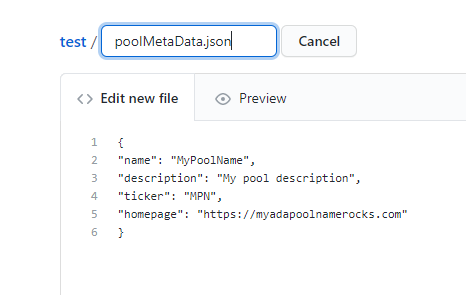
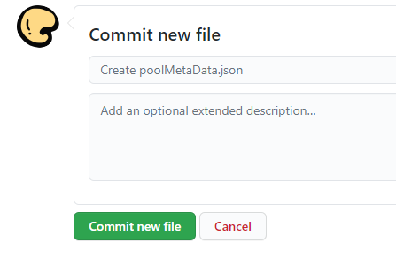

# **7.ステークプールの登録**

!!! Abstract "概要"
    こちらの手順は初回プール登録時のみ有効です。  
    プール登録後にメタ情報、誓約、固定費、変動費、リレー情報を変更する場合は、[プール情報(pool.cert)の更新](../operation/cert-update.md)の変更手順を実施してください。


!!! warning "プール登録料"
    ステークプール登録には**500ADA**の登録料が必要です。payment.addrに入金されている必要があります。


## **1.メタデータの作成**

!!! hint "ホームページを持っていない場合"
    「jsonファイルをGithubでホストする方法」を実施してください


=== "jsonファイルをGithubでホストする方法"

    !!! example ""

        1.Githubアカウントを作成しログインします [https://github.com/](https://github.com/)  

        2.右上の＋マークをクリックし**new repository** をクリックします。  

        3.**Repository name**に任意のリポジトリ名を入力し、**Create repository**をクリックします。  

        4.小さい文字で書かれた"**creating a new file**"をクリックします。  

        

        5.ファイル名を **poolMetaData.json** として入力し **json** コンテンツを貼り付けます。

        

        !!! hint "作成時の注意"
            * 下記は参考フォーマットとなります。ご自身のプール名、Ticker名に書き換えてください  
            * まだhomepageアドレスが無い場合は、ご自身のTwitterアドレスでも大丈夫です。
            * **ticker**名の長さは3～5文字以内で、A-Zと0-9のみで構成する必要があります。  
            * **description**の長さは255文字以内(255byte)となります。（ひらがな、漢字、カタカナは1文字2byte）


        ```bash
        {
        "name": "MyPoolName",
        "description": "My pool description",
        "ticker": "MPN",
        "homepage": "https://myadapoolnamerocks.com"
        }
        ```
        6.**Commit new file**をクリックします。

        

        7.作成したファイルの名前をクリックします。

        8.**Rawボタン**をクリックします。

        9.「**https://raw**」から始まるURLをコピーします。

        > 例: [https://raw.githubusercontent.com/coincashew/test/master/poolMetaData.json](https://raw.githubusercontent.com/coincashew/test/master/poolMetaData.json)

        10.URLは64文字より短くする必要があります。 [https://bitly.com/](https://bitly.com/) または[https://tinyurl.com/](https://tinyurl.com/)を使用してURLを短縮します。

        11.9でコピーしたURLを貼り付けます。

        12.短縮されたURLを[pool.cert作成時](./7-register-stakepool.md#poolcert)の`--metadata-url` に記述します。

        > 例:  
        > --metadata-url https://bit.ly/****

        13．**ブロックプロデューサーノード**でjsonファイルをダウンロードし、ハッシュ値を計算する。  

        !!! hint "ヒント"
            下記のURLを12で作成した**短縮URL**に置き換えてから実行してください
        
        ```bash
        cd $NODE_HOME
        wget -O poolMetaData.json https://bit.ly/****
        ```

    メタデータファイルのハッシュ値を計算します。
    === "ブロックプロデューサーノード"
        ```bash
        cardano-cli stake-pool metadata-hash --pool-metadata-file poolMetaData.json > poolMetaDataHash.txt
        ```


=== "ご自身のホームページサーバでホストする方法"
    !!! example ""
        !!! hint ""
            下記は参考フォーマットとなります。ご自身のプール名、Ticker名に書き換えてください  

        !!! hint "作成ルール"
            **ticker**名の長さは3～5文字にする必要があります。文字はA-Zと0-9のみで構成する必要があります。  
            **description**の長さは255文字以内(255byte)となります。（ひらがな、漢字、カタカナは1文字2byte）

        メタデータファイルを作成する。
        === "ブロックプロデューサーノード"

            ```bash
            cd $NODE_HOME
            cat > poolMetaData.json << EOF
            {
            "name": "MyPoolName",
            "description": "My pool description",
            "ticker": "MPN",
            "homepage": "https://myadapoolnamerocks.com"
            }
            EOF
            ```

        メタデータファイルのハッシュ値を計算します。

        ```bash
        cardano-cli stake-pool metadata-hash --pool-metadata-file poolMetaData.json > poolMetaDataHash.txt
        ```
        
        !!! danger "注意"
            **poolMetaData.json**をあなたの公開用WEBサーバへアップロードしてください。 


## **2.プール登録証明書の作成**

!!! important "ファイル転送"
    BPにある`vrf.vkey`と`poolMetaDataHash.txt` をエアギャップオフラインマシンのcnodeディレクトリにコピーします。
    ``` mermaid
    graph LR
        A[BP] -->|vrf.vkey / poolMetaDataHash.txt| B[エアギャップ];
    ``` 

** BPとエアギャップで`vrf.vkey`ファイルハッシュを比較する **

=== "ブロックプロデューサーノード"
    ```bash
    cd $NODE_HOME
    sha256sum vrf.vkey
    ```

!!! hint ""
    BPとエアギャップで表示された戻り値を比較して、ハッシュ値が一致していればOK  

=== "エアギャップオフラインマシン"
    ```bash
    cd $NODE_HOME
    sha256sum vrf.vkey
    ```

最小プールコスト(固定費)を出力します。

=== "ブロックプロデューサーノード"
    ```bash
    minPoolCost=$(cat $NODE_HOME/params.json | jq -r .minPoolCost)
    echo minPoolCost: ${minPoolCost}
    ```

!!! info ""
    minPoolCost(固定費)は 340000000 lovelace \(340 ADA\)です。


#### **pool.certを作成する** ####


??? note annotate "pool.cert作成時の注意点▼"
    
    pool.certはプール登録証明書の役割を果たし、プール情報を記載します。  
    上記のスクリプトは例です。ご自身のプール運用設定値に変更してください。  
    ** 誓約 100ADA ** 　(--pool-pledge)  

    ** 固定手数料 340ADA ** (--pool-cost)  
    ** 変動手数料5% ** (--pool-margin)  


??? note "誓約(Pledge)について▼"
    自分のプールに保証金を預けることを**Pledge\(誓約\)**と呼びます

    * 支払い用アドレス(payment.addr)の残高はPledge額よりも大きい必要があります。
    * 誓約金はpayment.addrに入金されている必要があります。
    * 設定した誓約数よりpayment.addrに入金されてるADAが下回っている場合、プール報酬が０になります。
    * 誓約金はロックされません。いつでも自由に取り出せますがプール登録証明書を再提出する必要があります。


??? note "リレーの記述について▼"
    上記のpool.cert作成時、自身のリレー情報を以下の3パターンの記述方法があります。

    **複数のリレーノードを構成する記述方法**

    **IPアドレス方式： 1ノード1IPアドレスの場合(分からない場合はこちら)**  
    [xxx.xxx.xxx]をリレーノードのパブリックIP(静的)アドレスへ書き換え
    ```bash
        --pool-relay-ipv4 xxx.xxx.xxx \
        --pool-relay-port 6000 \
        --pool-relay-ipv4 xxx.xxx.xxx \
        --pool-relay-port 6000 \
    ```

    **DNS方式：1つのエントリーの場合**  
    [relay1.yourdomain.com]をあなたのドメイン名に書き換え
    ```bash
        --single-host-pool-relay relay1.yourdomain.com \
        --pool-relay-port 6000 \
        --single-host-pool-relay relay2.yourdomain.com \
        --pool-relay-port 6000 \
    ```

    **ラウンドロビンDNSベース** [**SRV DNS record**](https://support.dnsimple.com/articles/srv-record/)の場合  
    [relay.yourdomain.com]をあなたのドメイン名に書き換え
    ```bash
        --multi-host-pool-relay relay.yourdomain.com \
        --pool-relay-port 6000 \
    ```


=== "エアギャップオフラインマシン"
    ```bash
    cd $NODE_HOME
    cardano-cli stake-pool registration-certificate \
        --cold-verification-key-file $HOME/cold-keys/node.vkey \
        --vrf-verification-key-file vrf.vkey \
        --pool-pledge 100000000 \
        --pool-cost 340000000 \
        --pool-margin 0.05 \
        --pool-reward-account-verification-key-file stake.vkey \
        --pool-owner-stake-verification-key-file stake.vkey \
        --mainnet \
        --pool-relay-ipv4 ***.***.***.*** \
        --pool-relay-port 6000 \
        --metadata-url https://bit.ly/**** \
        --metadata-hash $(cat poolMetaDataHash.txt) \
        --out-file pool.cert
    ```


**自身のステークプールに委任する証明書(deleg.cert)を作成します**

=== "エアギャップオフラインマシン"

    ```bash
    cardano-cli stake-address delegation-certificate \
        --stake-verification-key-file stake.vkey \
        --cold-verification-key-file $HOME/cold-keys/node.vkey \
        --out-file deleg.cert
    ```
!!! important "ファイル転送"
    エアギャップマシンの`pool.cert`と`deleg.cert`をBPのcnodeディレクトリにコピーします。
    ``` mermaid
    graph LR
        A[エアギャップ] -->|pool.cert / deleg.cert| B[BP];
    ```

## **3.プール登録トランザクションの送信**

**最新のスロット番号を取得する必要があります**

=== "ブロックプロデューサーノード"
    ```bash
    cd $NODE_HOME
    currentSlot=$(cardano-cli query tip --mainnet | jq -r '.slot')
    echo Current Slot: $currentSlot
    ```

**payment.addrの残高を出力します**

=== "ブロックプロデューサーノード"
    ```bash
    cardano-cli query utxo \
        --address $(cat payment.addr) \
        --mainnet > fullUtxo.out

    tail -n +3 fullUtxo.out | sort -k3 -nr > balance.out

    cat balance.out
    ```

**UTXOを算出します**

=== "ブロックプロデューサーノード"
    ```
    tx_in=""
    total_balance=0
    while read -r utxo; do
        in_addr=$(awk '{ print $1 }' <<< "${utxo}")
        idx=$(awk '{ print $2 }' <<< "${utxo}")
        utxo_balance=$(awk '{ print $3 }' <<< "${utxo}")
        total_balance=$((${total_balance}+${utxo_balance}))
        echo TxHash: ${in_addr}#${idx}
        echo ADA: ${utxo_balance}
        tx_in="${tx_in} --tx-in ${in_addr}#${idx}"
    done < balance.out
    txcnt=$(cat balance.out | wc -l)
    echo Total ADA balance: ${total_balance}
    echo Number of UTXOs: ${txcnt}
    ```

**poolDepositを出力します**

=== "ブロックプロデューサーノード"

    ```bash
    poolDeposit=$(cat $NODE_HOME/params.json | jq -r '.stakePoolDeposit')
    echo poolDeposit: $poolDeposit
    ```

**トランザクション仮ファイルを作成します**

=== "ブロックプロデューサーノード"

    ```bash
    cardano-cli transaction build-raw \
        ${tx_in} \
        --tx-out $(cat payment.addr)+$(( ${total_balance} - ${poolDeposit}))  \
        --invalid-hereafter $(( ${currentSlot} + 10000)) \
        --fee 0 \
        --certificate-file pool.cert \
        --certificate-file deleg.cert \
        --out-file tx.tmp
    ```

**最低手数料を計算します**

=== "ブロックプロデューサーノード"

    ```bash
    fee=$(cardano-cli transaction calculate-min-fee \
        --tx-body-file tx.tmp \
        --tx-in-count ${txcnt} \
        --tx-out-count 1 \
        --mainnet \
        --witness-count 3 \
        --byron-witness-count 0 \
        --protocol-params-file params.json | awk '{ print $1 }')
    echo fee: $fee
    ```


**計算結果を出力します**

=== "ブロックプロデューサーノード"

    ```bash
    txOut=$((${total_balance}-${poolDeposit}-${fee}))
    echo txOut: ${txOut}
    ```

**トランザクションファイルを作成します**

=== "ブロックプロデューサーノード"

    ```bash
    cardano-cli transaction build-raw \
        ${tx_in} \
        --tx-out $(cat payment.addr)+${txOut} \
        --invalid-hereafter $(( ${currentSlot} + 10000)) \
        --fee ${fee} \
        --certificate-file pool.cert \
        --certificate-file deleg.cert \
        --out-file tx.raw
    ```
!!! important "ファイル転送"
    BPの`tx.raw`をエアギャップオフラインマシンのcnodeディレクトリにコピーします。
    
    ``` mermaid
    graph LR
        A[BP] -->|tx.raw| B[エアギャップ];
    ```

**トランザクションに署名します**

=== "エアギャップオフラインマシン"
    ```bash
    cd $NODE_HOME
    cardano-cli transaction sign \
        --tx-body-file tx.raw \
        --signing-key-file payment.skey \
        --signing-key-file $HOME/cold-keys/node.skey \
        --signing-key-file stake.skey \
        --mainnet \
        --out-file tx.signed
    ```
!!! important "ファイル転送"
    エアギャップマシンの`tx.signed`をBPのcnodeディレクトリにコピーします。
    ``` mermaid
    graph LR
        A[エアギャップ] -->|tx.signed| B[BP];
    ```

**トランザクションを送信します**

=== "ブロックプロデューサーノード"
    ```bash
    cardano-cli transaction submit \
        --tx-file tx.signed \
        --mainnet
    ```
 > Transacsion Successfully submittedと表示されれば成功

## **4. プール登録確認**

**ステークプールIDは以下のように出力できます**

=== "エアギャップオフラインマシン"
    ```bash
    cardano-cli stake-pool id --cold-verification-key-file $HOME/cold-keys/node.vkey --output-format bech32 > stakepoolid_bech32.txt
    cardano-cli stake-pool id --cold-verification-key-file $HOME/cold-keys/node.vkey --output-format hex > stakepoolid_hex.txt
    ```

!!! important "ファイル転送"
    エアギャップマシンの`stakepoolid_bech32.txt`と`stakepoolid_hex.txt`をBPのcnodeディレクトリにコピーします。
    ``` mermaid
    graph LR
        A[エアギャップ] -->|stakepoolid_bech32.txt / stakepoolid_hex.txt| B[BP];
    ```

**以下のコマンドを実行し、赤文字の戻り値があればブロックチェーンに登録されています**
=== "ブロックプロデューサーノード"
    ```bash
    cd $NODE_HOME
    cardano-cli query stake-pools --mainnet --out-file allpoolsID.txt
    ```

    ```bash
    cat allpoolsID.txt | grep $(cat stakepoolid_bech32.txt)
    ```


**自分のステークプールが`Adapools.org`に登録されているか確認します**
=== "ブロックプロデューサーノード"
    ```
    cd $NODE_HOME
    cat stakepoolid_bech32.txt
    ```

表示されたPoolIDであなたのステークプールがブロックチェーンに登録されているか、次のサイトで確認することが出来ます。  
[Adapools.org](https://adapools.org/){ .md-button blank}

!!! success "🎊SPOデビューおめでとうございます🎊"
    上記サイトであなたのプールティッカーが表示されたらブロックチェーンに登録されました！しかしまだブロック生成できる状態ではありません。この後も重要な作業が続きますがあと一息頑張ってください！

