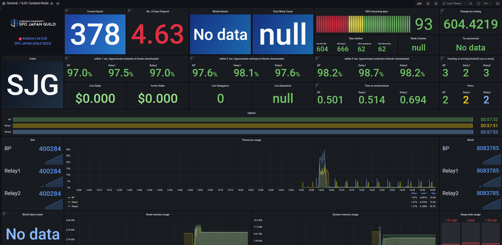

# **9.監視ツールセットアップ**

プロメテウスはターゲットに指定したメトリックHTTPエンドポイントをスクレイピングし、情報を収集する監視ツールです。[オフィシャルドキュメントはこちら](https://prometheus.io/docs/introduction/overview/) グラファナは収集されたデータを視覚的に表示させるダッシュボードツールです。

### **9-1.インストール**

!!! abstract "概要"
    「prometheus」および「prometheus node exporter」をインストールします。 この手順では、リレーノード1でprometheusとGrafana本体を稼働させ、各サーバーの情報を取得する方法です。

**構成図**
``` mermaid
    flowchart TB
        bp[ローカルPC] -- 3000ポート開放 --> a1[Grafana] 
        a2[prometheus] -- リレー1IP指定で<br>9100/12798ポート開放 --> ide2[BP] & ide3[リレー2]
        subgraph ide1[リレー1]
            a1[Grafana] <--> a2[prometheus]
        end
        subgraph ide2[BP]
            a3[node-exporter]
        end
        subgraph ide3[リレー2]
            a4[node-exporter]
        end
```

prometheusインストール

=== "リレーノード1"
    ```text
    sudo apt install -y prometheus prometheus-node-exporter
    ```

=== "BPまたはリレー2以降"

    ```bash
    sudo apt install -y prometheus-node-exporter
    ```

grafanaインストール

=== "リレーノード1"
    ```bash
    wget -q -O - https://packages.grafana.com/gpg.key | sudo apt-key add -
    ```
    ```bash
    echo "deb https://packages.grafana.com/oss/deb stable main" > grafana.list
    sudo mv grafana.list /etc/apt/sources.list.d/grafana.list
    ```
    ```bash
    sudo apt update && sudo apt install -y grafana
    ```

サービス有効化とファイアウォールを設定する。

=== "リレーノード1"

    ```bash
    sudo systemctl enable grafana-server.service
    sudo systemctl enable prometheus.service
    sudo systemctl enable prometheus-node-exporter.service
    ```

    FW設定でGrafanaポートを開放する
    ```bash
    sudo ufw allow 3000/tcp
    sudo ufw reload
    ```

=== "BPまたはリレー2以降"
    
    ```bash
    sudo systemctl enable prometheus-node-exporter.service
    ```
    
    FW設定でPrometheusメトリクスポートをリレー1のIP限定で開放する
    ```bash
    sudo ufw allow from <リレーノード1のIP> to any port 12798
    sudo ufw allow from <リレーノード1のIP> to any port 9100
    sudo ufw reload
    ```

prometheus-node-exporterアップデート

=== "リレーノード/BP"
    prometheus-node-exporterのパスを取得する
    ```bash
    cd $HOME/git
    nodeexPath=`which prometheus-node-exporter`
    ```

    1.5.0をダウンロードする
    ```bash
    wget https://github.com/prometheus/node_exporter/releases/download/v1.5.0/node_exporter-1.5.0.linux-amd64.tar.gz
    ```

    ダウンロードファイルを解凍する
    ```bash
    tar xvf node_exporter-1.5.0.linux-amd64.tar.gz
    ```

    サービスを停止する
    ```bash
    sudo systemctl stop prometheus-node-exporter.service
    ```
    
    バイナリファイルをシステムフォルダへコピーする
    ```bash
    cd node_exporter-1.5.0.linux-amd64
    sudo cp node_exporter $nodeexPath
    ```

    サービスをスタートする
    ```bash
    sudo systemctl start prometheus-node-exporter.service
    ```
    
    バージョン確認
    
    ```bash
    prometheus-node-exporter --version
    ```
    > 戻り値1行目が`node_exporter, version 1.5.0`ならOK


## **9-2.設定ファイルの作成**

リレーノード1にインストールしたPrometheusの設定ファイルを作成します。ここに記載されたサーバーのデータを取得します。

=== "リレーノード1(リレー1台の場合)"
    !!! warning "注意"
        targets:の「xxx.xxx.xxx」は、BPのパブリックIP(静的)アドレスに置き換えて下さい

    ```bash
    cat > prometheus.yml << EOF
    global:
      scrape_interval:     15s # By default, scrape targets every 15 seconds.

      # Attach these labels to any time series or alerts when communicating with
      # external systems (federation, remote storage, Alertmanager).
      external_labels:
        monitor: 'codelab-monitor'
    
    # A scrape configuration containing exactly one endpoint to scrape:
    # Here it's Prometheus itself.
    scrape_configs:
      # The job name is added as a label job=<job_name> to any timeseries scraped from this config.
      - job_name: 'prometheus'

        static_configs:
          - targets: ['localhost:9100']
            labels:
              alias: 'relaynode1'
              type:  'system'
          - targets: ['xxx.xxx.xxx.xxx:9100']
            labels:
              alias: 'block-producing-node'
              type:  'system'
          - targets: ['xxx.xxx.xxx.xxx:12798']
            labels:
              alias: 'block-producer-node'
              type:  'cardano-node'
          - targets: ['localhost:12798']
            labels:
              alias: 'relaynode1'
              type:  'cardano-node'
    EOF
    ```

=== "リレーノード1(リレー2台の場合)"
    !!! warning "注意"
        targets:の「xxx.xxx.xxx」は、BPのパブリックIP(静的)アドレスに置き換えて下さい。  
        targets:の「bb.xxx.xxx」は、リレー2のパブリックIP(静的)アドレスに置き換えて下さい。

    ```bash
    cat > prometheus.yml << EOF
    global:
      scrape_interval:     15s # By default, scrape targets every 15 seconds.

      # Attach these labels to any time series or alerts when communicating with
      # external systems (federation, remote storage, Alertmanager).
      external_labels:
        monitor: 'codelab-monitor'
    
    # A scrape configuration containing exactly one endpoint to scrape:
    # Here it's Prometheus itself.
    scrape_configs:
      # The job name is added as a label job=<job_name> to any timeseries scraped from this config.
      - job_name: 'prometheus'

        static_configs:
          - targets: ['localhost:9100']
            labels:
              alias: 'relaynode1'
              type:  'system'
          - targets: ['bb.xxx.xxx.xxx:9100']
            labels:
              alias: 'relaynode2'
              type:  'system'
          - targets: ['xx.xxx.xxx.xxx:9100']
            labels:
              alias: 'block-producing-node'
              type:  'system'
          - targets: ['xxx.xxx.xxx.xxx:12798']
            labels:
              alias: 'block-producer-node'
              type:  'cardano-node'
          - targets: ['localhost:12798']
            labels:
              alias: 'relaynode1'
              type:  'cardano-node'
          - targets: ['bb.xxx.xxx.xxx:12798']
            labels:
              alias: 'relaynode2'
              type:  'cardano-node'
    EOF
    ```

prometheus.ymlを移動します
=== "リレーノード1"
    ```bash
    sudo mv prometheus.yml /etc/prometheus/prometheus.yml
    ```

    Grafanaプラグインをインストールする
    ```
    sudo grafana-cli plugins install yesoreyeram-infinity-datasource
    ```

サービスを起動します。

=== "リレーノード1"

    ```bash
    sudo systemctl restart grafana-server.service
    sudo systemctl restart prometheus.service
    sudo systemctl restart prometheus-node-exporter.service
    ```

サービスが正しく実行されていることを確認します。

=== "リレーノード1"

    ```bash
    sudo systemctl --no-pager status grafana-server.service prometheus.service prometheus-node-exporter.service
    ```
    !!! hint "戻り値確認"
        * grafana-server.service
        * prometheus.service
        * prometheus-node-exporter.service  
        上記3つのプログラムが 緑色 `active (running)` になっていることを確認する。


## **9-3.ノード設定ファイルの更新**
=== "リレーノード/BP"

    ```bash
    cd $NODE_HOME
    sed -i ${NODE_CONFIG}-config.json -e "s/127.0.0.1/0.0.0.0/g"
    ```


ノードを再起動し設定ファイルを有効化します。

=== "リレーノード/BP"

    ```bash
    sudo systemctl reload-or-restart cardano-node
    ```


## **4.Grafanaダッシュボードの設定**

1. ローカルブラウザから http://&lt;リレーノード1IPアドレス&gt;:3000 を開きます。
2. ログイン名・PWは **admin** / **admin**
3. パスワードを変更します。
4. 左メニューの歯車アイコンから データソースを追加します。
5. 「Add data source」をクリックし、「Prometheus」を選択します。
6. 名前は `Prometheus`としてください。
7. **URL** を [http://localhost:9090](http://localhost:9090)に設定します。
8. **Save & Test**をクリックし`Data source is working`と表示されたら`back`をクリックします。
9. 再度「Add data source」をクリックし、下部にある「Infinity」をクリックします。
10. 設定内容を変更することなく、**Save & Test**をクリックし`OK. Settings saved`と表示されたら`back`をクリックします。
11. BPサーバーでパネル用JSONファイルをダウンロードします。
=== "ブロックプロデューサーノード"
```
curl -s -o $NODE_HOME/SJG_Grafana_Dashboard.json https://raw.githubusercontent.com/akyo3/Extends-SJG-Knowledge/main/SJG_Grafana_Dashboard.json
```
一部ファイル内容を書き換える
```
sed -i $NODE_HOME/SJG_Grafana_Dashboard.json \
    -e "s/bech32_id_of_your_pool/$(cat $NODE_HOME/stakepoolid_bech32.txt)/g"
```
12. BPの`cnode`フォルダにある`SJG_Grafana_Dashboard.json`をローカルPCにダウンロードします  
13. 左メニューの□アイコン(Dashboards)→`+import`をクリックします。  
14. 「Upload JSON file」をクリックし、10でダウンロードした`SJG_Grafana_Dashboard.json`を指定します。  
15. 「Prometheus」と「Infinity」のプルダウンを選択し`Import`ボタンをクリックします。  





!!! success "🎊おめでとうございます🎊"
    これで基本的な監視設定は完了です。必要に応じてノード異常時の通知設定を行ってください