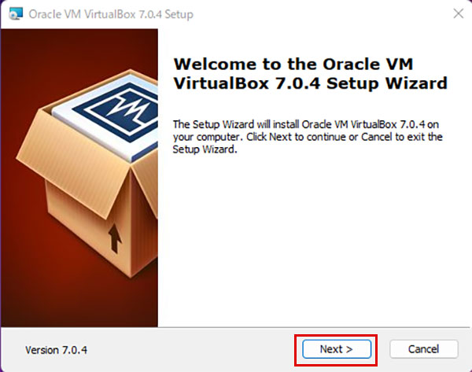
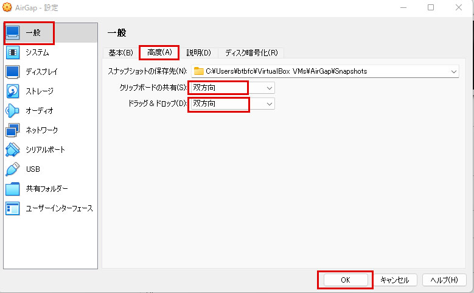
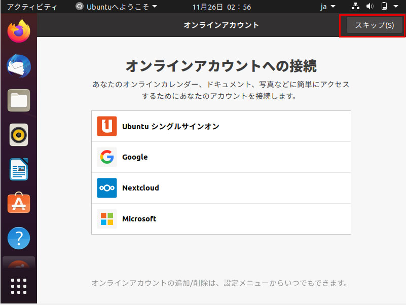
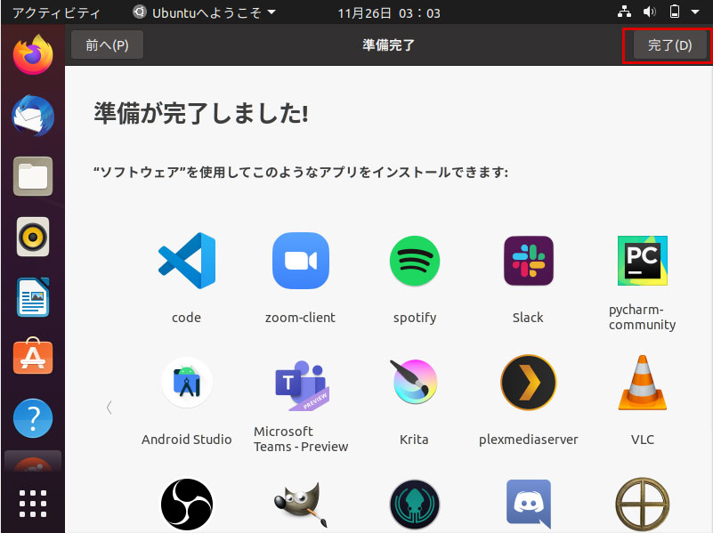
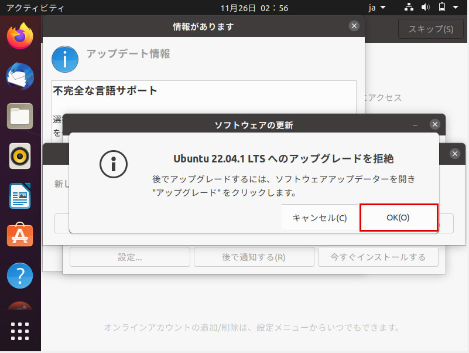
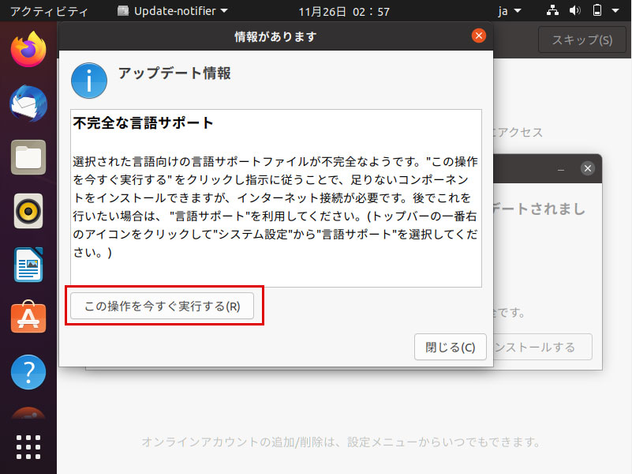
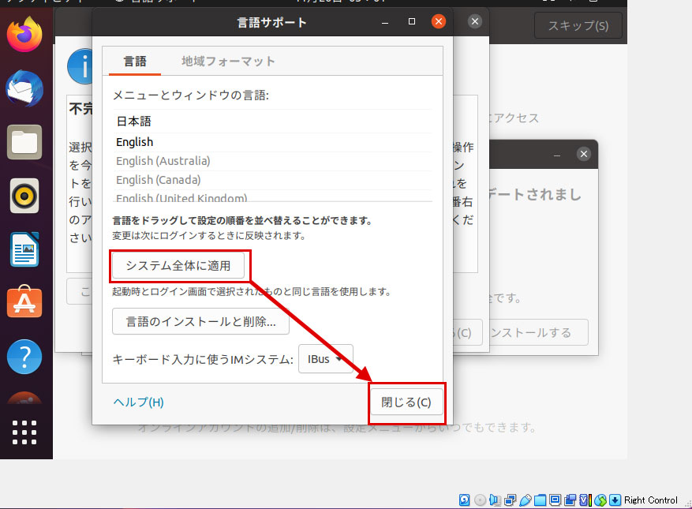
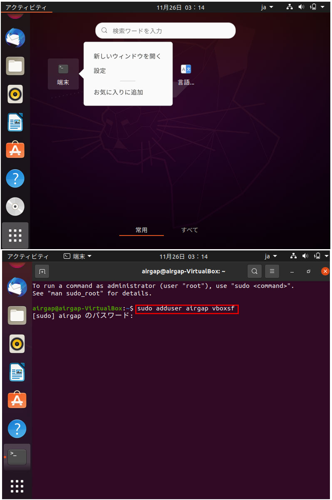
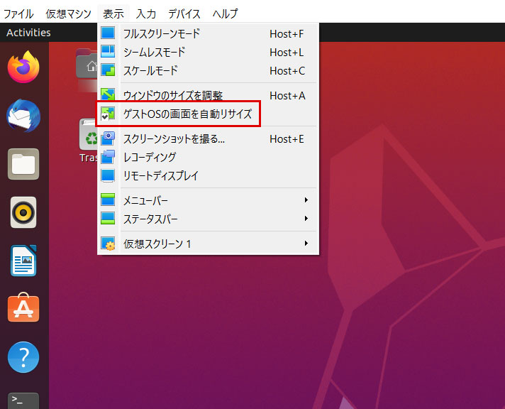

# **エアギャップマシンの作成**

!!! summary "エアギャップマシンとは？"
    プール運営で使用するウォレットの秘密鍵やプール運営の秘密鍵をオフライン上で管理し、エアギャップオフラインマシンでCLIを起動しトランザクションファイルに署名する作業に使用します。
    
    * ウォレットの秘密鍵やプール運営の秘密鍵をプール運営のオンラインマシン上に保管すると、ハッキングなどの際に資金盗難のリスクがあります。

## Windowsの場合

!!! hint "貢献者"
    [[SA8] SMAN8](https://adapools.org/pool/ec736597797c68044b8fccd4e895929c0a842f2e9e0a9e221b0a3026) さんに導入手順を作成頂きました。ありがとうございます！

### インストール要件
**環境**

* Windows11 Home
* 実装RAM 8.00 GB

**ダウンロード/インストール**

* Ubuntu Desktop 20.04.4 LTS  
* VirtualBox-7.0.4  
---

### **1- OS Ubuntuの入手**
3-1.下の画像の赤い四角のところをタップしてダウンロードします。

- [Ubuntu20.04.4 LTSの入手](https://releases.ubuntu.com/20.04/)


3-2.ダウンロードしたubuntu-20.04.4-desktop-amd64を作成したフォルダ(ここではTest_CNodeというフォルダ)に移動しておく。


### **2- VirtualBoxのダウンロード**
1-1. VirtualBoxのダウンロードサイトにアクセスし、`Windows hosts`をタップしダウンロードする。

 * [VirtualBoxの入手](https://www.virtualbox.org/wiki/Downloads)

### **3- VirtualBoxのインストール**

2-1.ダウンロードしたvirtualbox6.1.36のインストーラをダブルクリックで起動する。

| ファイル名 |
| ------------- |
|VirtualBox-7.0.4-154605-Win.exe|


2-2.ダウンロードが完了したら、左下の赤い四角のインストーラーをタップして起動する。


2-3.この画面になったら、`Next>`をタップ。



2-4.続けてそのまま`Next>`をタップし、画像の順番に進み最後に`Install`をクリックする。


2-5.Windowsセキュリティが作動し、デバイスのソフトウェアをインストールしますか？と聞かれたら`インストール(I)`をタップし、下の画像の赤い四角で囲まれた`Finish`をタップする。


2-6.VirtualBoxの管理画面が立ち上がり、インストールが完了しました。


### **4- VirtualBoxの仮想マシンの作成**
4-1.マシンを作成する為に下の画像の赤い四角の`新規(N)`をクリックする。


4-2.マシン設定  
名前・・・任意の仮想マシン名  
ISO Imagae・・・1でダウンロードしたUbuntu-ISOファイルを指定する  
「Skip Unattended Installation」にチェックして「次へ」をクリック。


4-3.メインメモリを`4096MB`、Processorosを`2`に設定し「次へ」をクリック


4-4.DiskSizeを`50.00GB`に設定し「次へ」をクリック


4-5.バーチャルマシン作成概要の確認。「完了」をクリック


### **5- VirtualBoxの仮想マシンの環境設定**

5-1.使用する仮想マシン(ここではAirGap)を選択し、「設定」アイコンをクリックする


**一般**
5-2.「一般」→「高度」タブからクリップボードの共有とドラッグ&ドロップを「双方向」に変更してOKをクリック



**システム**
5-3.「システム」→「マザーボード」タブの「フロッピー」のチェックを`外す`。チップセットを`ICH9`に変更してOKをクリック


**共有フォルダ設定**

5-4.WindowsとUbuntu間の共有フォルダ(Share)を作成する(ドキュメントフォルダなどの任意の場所)


5-5.共有フォルダーから新規追加アイコンをクリック  

* 「フォルダーのパス」に5-4で作成したフォルダを指定する  
* マウントポイントに`/media/share_win`を入力する  
* 「自動マウント」にチェックする


### **6- Ubuntuのインストール**

6-1.`起動`をクリック。


6-2.下の画像のようにディスクが起動し始めます。


6-3.左の枠の中から`日本語`を選択し`Ubuntuをインストール`をクリックします。


6-5.日本語キーボードの方は、両方とも「Japanese」を選択し、設定が完了したら「続ける」をクリックします。

>USキーボードの方は「キーボードレイアウト」→「キーボードレイアウトの検出」をクリックして設定してください。
※ 画面が見切れている場合の対処法：Alt＋F7を押すとマウスでウィンドウを移動できます)


6-6.下の画像の状態のまま、`続ける`をクリック


6-7.下の画像の状態のまま、`インストール`をクリック。


6-8.`続ける`をクリック。


6-9.お住まいの地域をクリックし、`続ける`をクリック。


6-10.`あなたの名前`はマシン名を入れると、その下の`コンピューターの名前`、`ユーザー名の入力`にも自動で入力されます。そして、パスワードをご自身で決めて入力を済ませて下さい。終わりましたら、`続ける`をタップ。


6-11.Ubuntuのインストールが始まりました。しばらくお待ちください。


6-12.インストール完了後、再起動を行って下さい


6-13.ログインします


6-14.オンラインアカウントの接続は、右上の`スキップ(S)`をクリック。



6-15.`次へ`をタップします。


6-16.そのまま、`次へ（N)`をタップ。


6-17.`いいえ、送信しません`を選択し、右上の`次へ(N)`をタップします。


6-18.インストールが終わりました。`完了`をクリック。



6-19.新バージョンは「アップグレードしない」をクリックします


6-20.`OK`をクリック。



6-21.`この操作を今すぐ実行`をクリック。



6-22.`インストール`をクリック。


6-23.`インストール`をクリック。


6-23.インストール完了後`全体に適用する`をクリックし閉じる




### **7- Guest Additionsのインストール**

アプリ一覧からターミナル(端末)を起動し以下コマンドを手動入力する。
```
sudo apt updata -y
sudo apt upgrade -y
sudo apt install gcc make perl -y
```
>まだコピーアンドペーストが利用できないため、タイプミスに留意してください。

7-1.ホストメイン画面上部の「Devices」タブから「Insert Guest Additions CD image...」⇒`OK`をクリックします。


7-2.以下のメッセージが表示されたら`実行`をクリックした後、パスワードを入力します。


7-3処理完了のメッセージが表示されましたら`Enter`キーをタップします。


7-4.ターミナル(端末)を起動しユーザーをグループ化するコマンドを実行。

```
sudo adduser $USER vboxsf
```



7-5.フォルダに`shere_win`が表示されていれば、5の「共有フォルダ」で設定したローカルPCのフォルダと同期します。


7-6.コピー＆ペーストできるかホストPCでコマンドを`コピー`してゲストOSの端末で右クリックして`貼り付け`してみる。問題なければ、これで終了です。お疲れ様でした！


7-7.「表示」→「Auto-resize　Guest　Display」にチェックが入っている事を確認します。



---

上記手順を行なっても、「共有フォルダが表示されない」「共有フォルダ化されていない」場合は、一度VBox_GAs_6.1.36をアンマウントしてから再度挿入し、再起動すると共有フォルダは完了します。それでもダメなら[GUI操作でGuest Additionsがインストールできなかった場合](./#guiguest-additions)を試してください。

### 8- Swapファイルの作成  
8-1. 既存Swapファイルを削除  
```console
sudo swapoff /swapfile
```
```console
sudo rm /swapfile
```

---

8-2. 新規Swapファイルを作成  
```console
cd $HOME
sudo fallocate -l 6G /swapfile
```
```console
sudo chmod 600 /swapfile
```
```console
sudo mkswap /swapfile
sudo swapon /swapfile
sudo swapon --show
```
```console
sudo cp /etc/fstab /etc/fstab.bak
echo '/swapfile none swap sw 0 0' | sudo tee -a /etc/fstab
echo 'vm.swappiness=10' | sudo tee -a /etc/sysctl.conf
echo 'vm.vfs_cache_pressure=50' | sudo tee -a /etc/sysctl.conf
cat /proc/sys/vm/vfs_cache_pressure
cat /proc/sys/vm/swappiness
```

## Macの場合

!!! hint "貢献者"
    [[WYAM] WYAM-StakePool](https://adapools.org/pool/940d6893606290dc6b7705a8aa56a857793a8ae0a3906d4e2afd2119) Akyoさんに導入手順を作成頂きました。ありがとうございます！

### インストール要件
**環境**
- macOS Ventura version13.0

**ダウンロード/インストール**
- VirtualBox バージョン 7.0.4
- Ubuntu Desktop 20.04.5 LTS (Focal Fossa)


---

### 1- Ubuntuイメージファイルのダウンロード

1-1. 以下のリンク先からISOイメージファイルをダウンロードします。

  - [Ubuntuを入手する](https://releases.ubuntu.com/20.04/)
※ ダウンロード完了まで少しかかるのでしばらくお待ちください

| ファイル名 | ubuntu-20.04.5-desktop-amd64.iso |
:---|:---


---

### 2- VirtualBoxのダウンロード/インストール

2-1. 以下のリンク先からVirtualBoxをインストールします。

  - [VirtualBoxを入手する](https://www.virtualbox.org/wiki/Downloads)


| ファイル名 | VirtualBox-7.0.4-154605-OSX.dmg |
:---|:---


---

2-2. ダウンロードしたファイルをクリックし、インストールウィザードに従ってインストールします。
完了したら「閉じる」をクリックして終了します。


> macOS BigSur 以降では、インストールしたカーネル拡張をロードできるようにするために再起動が必要です。


---

### 3- VirtualBoxで仮想マシンを作成
> VirtualBoxのアイコンをクリックし、起動します。

3-1. VirtualBoxが起動したら「新規」をクリックします。


---

3-2. 以下の項目を設定し、「続き」をクリックします。
> ※ 名前はお好みで入力してください。
> ISO Imageは、「その他」を選択し、ダウンロードしたUbuntu-20.04.5のISOイメージファイルを選択します。  
タイプ、バージョンについては上記を選択すればデフォルトで設定されます。    
> `Skip Unattended Installation`にチェック


| 名前 | airGap |
:---|:---
| Folder | デフォルトでOK |


  ---

3-3. 仮想マシンに割当てるメモリサイズは「`4096`MB」、Processorsは「`2`」を選択し「次へ」をクリックします。


---

3-4. Virtual Hard diskは「`50`GB」を入力し、「次へ」をクリックします。


3-5. 概要を確認して「完了」をクリックします。


---

### 4- 仮想マシンの仕様設定

> 「完了」をクリックしたら「Oracle VM VirtualBox マネージャー」画面に遷移するので設定毎に「設定」をクリックしてください。

**一般**

4-1. 「設定」→「一般」→「高度」タブから、以下の設定を「双方向」にし、「OK」をクリックします。


---

**システム**

4-2. 「マザーボード」タブを以下の設定にし、「OK」をクリックします。

| マザーボード |  |
:---|:---
| 起動順序 | 「フロッピー」のチェックマークを外す |
| チップセット | ICH9 |
| ポインティングデバイス | PS/2マウス |


---

**ディスプレイ**

4-3. 「スクリーン」タブから以下の設定にし、「OK」をクリックします。

| ビデオメモリー | 128MB |
:---|:---
| 表示倍率 | 200% |
| グラフィックスコントローラー | VMSVGA |


---

**共有フォルダー**

4-4. ホスト側で共有させたいフォルダを事前に作成しておきます。
- 例）「airGap」フォルダを作成後、配下に「share」フォルダを作成。

`Mac Terminal`
```console
mkdir -p $HOME/airGap/share
```

---

4-5. 共有フォルダを指定します。


---

### 5- 仮想マシンにUbuntuをインストール

5-1. 仮想マシンを起動します。


> PCから権限許可を求められたら「セキュリティとプライバシー」にて必要な権限を許可し、VirtualBoxを再起動します。

---

5-2. 読み込み終了後、言語は「日本語」にし、「Install Ubuntu」をクリックします。


---

5-3. キーボード設定では、日本語キーボードの方は、両方とも「Japanese」を選択し、設定が完了したら「続ける」をクリックします。  
> USキーボードの方は「キーボードレイアウト」→「キーボードレイアウトの検出」をクリックして設定してください。  
※ 画面が見切れていた場合の対処法：Alt＋F7で移動できます)

---

5-4. 「アップデートと他のソフトウェア」の設定では、以下のように設定し、「続ける」をクリックします。


---

5-5. 「インストールの種類」の設定では「ディスクを削除してUbuntuをインストール」を選択し、「インストール」をクリックします。


---

5-6. 「ディスクに変更を書き込みますか?」の設定では「続ける」をクリックします。


---

5-7. タイムゾーンの設定は、「Tokyo」を選択し、「続ける」をクリックします。


---

5-8. 必要な情報を入力し、「続ける」をクリックします。
> ※ 画像は一例ですのでお好みで設定してください。


---

5-9. インストール開始。


---

5-10. インストール完了後、VMの再起動を求められるので「今すぐ再起動する」をクリックし、Enterキーを押下します。


---

5-11. 再起動後、ユーザー名をクリックし、パスワードを入力してログインします。

---

5-12. 「オンラインアカウントへの接続」の設定では右上の「スキップ」をクリックします。


---

5-13. 「Livepatch」の設定では右上の「次へ」をクリックします。


---

5-14. 「Ubuntuの改善を支援する」の設定では、「いいえ、送信しません」を選択後、右上の「次へ」をクリックします。


---

5-15. 「プライバシー」の設定では右上の「次へ」をクリックします。


---

5-16. 「準備完了」と表示されたら右上の「完了」をクリックします。


---

5-17. 「ソフトウェアの更新」を求められたら「アップグレードしない」をクリックし、その後「OK」をクリックします。


---

5-18. 「アップデート情報→不完全な言語サポート」が表示されたら「この操作を今すぐ実行する」→「インストール」をクリック後、認証を求められるのでパスワードを入力し、「システム全体に適用」をクリックします。


---

### 6- Guest Additionsのインストール
6-1. ターミナルを開いて以下を実行します。
> Guest Additionsがインストールされていない状態なのでホストからゲストにコピーアンドペーストできません。タイプミスに留意してください。  
> また以下の手順を行なっても、共有フォルダがGUIで表示されない、共有フォルダ化されていない場合は、一度VBox_GAs_6.1.36をアンマウントしてから再度挿入し、再起動すると共有フォルダは完了します。  
> それでもダメなら[`GUI操作でGuest Additionsがインストールできなかった場合`](#guiguest-additions)を試してください。
```console
sudo apt update -y
sudo apt upgrade -y
sudo apt install gcc make perl -y
```

---

6-2. ホストメイン画面上部の「Devices」タブから「Insert Guest Additions CD image...」→「OK」をクリックします。

---

6-3. 以下のメッセージが表示されたら「実行」をクリックした後、パスワードを入力します。


---

6-4. 処理完了のメッセージが表示されたらEnterキーを押下します。
> 画面が点滅した場合は、リサイズが行われているのでそのまま少し待っていると点滅しなくなるはずです。


---

6-5. ユーザーを`vboxsf`グループに追加して再起動します。
```console
sudo adduser $USER vboxsf
sudo reboot
```

---

6-6. 「View」→「Auto-resize　Guest　Display」にチェックが入っている事を確認します。  
> 確認後、右クリック→「取り出す」をクリックします。


---

6-7. テストファイル作成  
ターミナルを開いて以下を実行します。
> 共有フォルダにテストファイルを作成してホスト側で確認できたら成功です。

```console
touch /media/sf_share/test.txt
ls /media/sf_share/
```

実行結果としてVMとホストに`test.txt`が作成されていることを確認します。


---

### 6- Swapファイルの作成  
6-1. 既存Swapファイルを削除  
```console
sudo swapoff /swapfile
```
```console
sudo rm /swapfile
```

---

6-2. 新規Swapファイルを作成  
```console
cd $HOME
sudo fallocate -l 6G /swapfile
```
```console
sudo chmod 600 /swapfile
```
```console
sudo mkswap /swapfile
sudo swapon /swapfile
sudo swapon --show
```
```console
sudo cp /etc/fstab /etc/fstab.bak
echo '/swapfile none swap sw 0 0' | sudo tee -a /etc/fstab
echo 'vm.swappiness=10' | sudo tee -a /etc/sysctl.conf
echo 'vm.vfs_cache_pressure=50' | sudo tee -a /etc/sysctl.conf
cat /proc/sys/vm/vfs_cache_pressure
cat /proc/sys/vm/swappiness
```
---

## 補足

### 本番運用で使用する際の注意点

- 本番運用で使用される場合は必ず「ネットワークアダプターを有効化」のチェックを外してください。  
[2-8. エアギャップオフラインマシンの作成](https://docs.spojapanguild.net/setup/2-node-setup/#2-8)を終えた後に行ってください。


### GUI操作でGuest Additionsがインストールできなかった場合
Virtualbox guest addition packagesをインストールします。
> ターミナルを開いて以下のコマンドを実行してください。  
> Guest Additionsがインストールされていない状態なのでホストからゲストにコピーアンドペーストできません。タイプミスに留意してください。  
> 成功していれば再起動後、コピーアンドペーストできます。
```console
sudo apt update -y
sudo apt upgrade -y
sudo add-apt-repository multiverse
sudo apt install virtualbox-guest-dkms virtualbox-guest-x11 -y
```

ユーザーを`vboxsf`グループに追加して再起動します。
```console
sudo adduser $USER vboxsf
sudo reboot
```

共有フォルダが追加されているか確認
```console
df
```
> `share`          488245288 203122832 285122456  42% `/media/sf_share`

共有フォルダのグループを確認
```console
ls -l /media
```
> drwxrwx--- 1 root `vboxsf` 96  x月 xx xx:xx sf_share

テストファイル作成  
> 共有フォルダにテストファイルを作成してホスト側で確認できたら成功です。

```console
touch /media/sf_share/test.txt
ls /media/sf_share/
```

実行結果としてVMとホストに`test.txt`が作成されていることを確認します。
